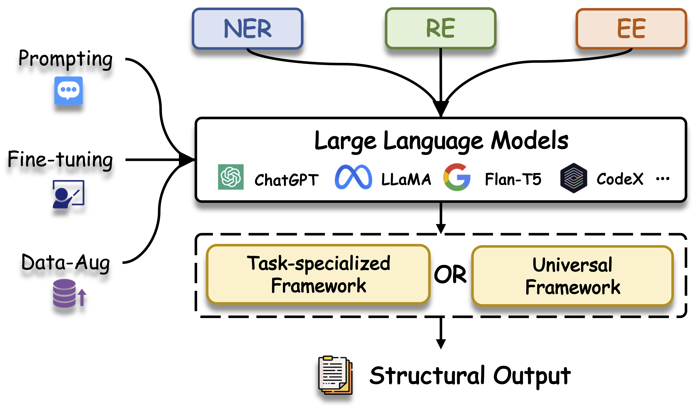

# Awesome-LLM4IE-Papers

Awesome papers about generative Information extraction using LLMs

The organization of papers is discussed in our survey: [Large Language Models for Generative Information Extraction: A Survey](https://arxiv.org/abs/2312.17617). 

If you find any relevant academic papers that have not been included in our research, please submit a request for an update. We welcome contributions from everyone.

If any suggestions or mistakes, please feel free to let us know via email at **derongxu@mail.ustc.edu.cn** and **chenweicw@mail.ustc.edu.cn**. We appreciate your feedback and help in improving our work.

If you find our survey useful for your research, please cite the following paper:

    @misc{xu2023large,
        title={Large Language Models for Generative Information Extraction: A Survey}, 
        author={Derong Xu and Wei Chen and Wenjun Peng and Chao Zhang and Tong Xu and Xiangyu Zhao and Xian Wu and Yefeng Zheng and Enhong Chen},
        year={2023},
        eprint={2312.17617},
        archivePrefix={arXiv},
        primaryClass={cs.CL}
    }
    
## 📒 Table of Contents
- [Information Extraction tasks](#information-extraction-tasks)
    - [Named Entity Recognition](#named-entity-recognition)
    - [Relation Extraction ](#relation-extraction)
    - [Event Extraction](#event-extraction)
    - [Universal Information Extraction](#universal-information-extraction)
- [Information Extraction Techniques](#information-extraction-techniques)
    - [Supervised Fine-tuning](#supervised-fine-tuning)
    - [Few-shot ](#few-shot)
    - [Zero-shot](#zero-shot)
    - [Data Augmentation](#data-augmentation)
    - [Prompts Design](#prompts-design)
    - [Constrained Decoding Generation](#constrained-decoding-generation)
- [Specific Domain](#specific-domain)
- [Evaluation and Analysis](#evaluation-and-analysis)
- [Project and Toolkit](#project-and-toolkit)
- ⏰ [Recently Updated Papers](#recently-updated-papers) (After 2024/09/04, the updated papers is here~)
- ⭐️ [Datasets](#datasets) (with Download Link~)

## 💡 News
- **Update Logs**
    - The details can be find in <code>./update_new_papers_list</code>.
    - **2024/09/04** Add 22 papers
    - **2024/06/06** Add 41 papers
    - **2024/03/30** Add 27 papers
    - **2024/03/29** Add 20 papers

# Information Extraction tasks
A taxonomy by various tasks.
## Named Entity Recognition 
Models targeting only ner tasks.
### Entity Typing
|  Paper  |      Venue    |   Date  | Code |
| :----- | :--------------: | :------- | :---------: |
|  [Calibrated Seq2seq Models for Efficient and Generalizable Ultra-fine Entity Typing](https://aclanthology.org/2023.findings-emnlp.1040/)  |   EMNLP Findings      |  2023-12   | [GitHub](https://github.com/yanlinf/CASENT) |
|  [Generative Entity Typing with Curriculum Learning](https://arxiv.org/abs/2210.02914)  |   EMNLP       |  2022-12   | [GitHub](https://github.com/siyuyuan/GET) |
### Entity Identification & Typing 
|  Paper  |      Venue    |   Date  | Code |
| :----- | :--------------: | :------- | :---------: |
| [VerifiNER: Verification-augmented NER via Knowledge-grounded Reasoning with Large Language Models](https://aclanthology.org/2024.acl-long.134/) | ACL | 2024 | [GitHub](https://github.com/emseoyk/VerifiNER) | 
| [ProgGen: Generating Named Entity Recognition Datasets Step-by-step with Self-Reflexive Large Language Models](https://aclanthology.org/2024.findings-acl.947/) | ACL Findings | 2024 | [GitHub](https://github.com/StefanHeng/ProgGen) |
| [Rethinking Negative Instances for Generative Named Entity Recognition](https://aclanthology.org/2024.findings-acl.206/) |  ACL Findings | 2024 | [GitHub](https://github.com/yyDing1/GNER) |
| [LLMs as Bridges: Reformulating Grounded Multimodal Named Entity Recognition](https://aclanthology.org/2024.findings-acl.76/) | ACL Findings | 2024 | [GitHub](https://github.com/JinYuanLi0012/RiVEG) |
| [RT: a Retrieving and Chain-of-Thought framework for few-shot medical named entity recognition](https://academic.oup.com/jamia/advance-article/doi/10.1093/jamia/ocae095/7665312) | Others | 2024-05 | [GitHub](https://github.com/ToneLi/RT-Retrieving-and-Thinking) |
| [P-ICL: Point In-Context Learning for Named Entity Recognition with Large Language Models](https://arxiv.org/abs/2405.04960) | Arxiv | 2024-06 | [GitHub](https://github.com/jiangguochaoGG/P-ICL) |
| [Astro-NER -- Astronomy Named Entity Recognition: Is GPT a Good Domain Expert Annotator?](https://arxiv.org/abs/2405.02602) | Arxiv | 2024-05 |  |
| [Know-Adapter: Towards Knowledge-Aware Parameter-Efficient Transfer Learning for Few-shot Named Entity Recognition](https://aclanthology.org/2024.lrec-main.854/) | COLING | 2024 |  |
| [ToNER: Type-oriented Named Entity Recognition with Generative Language Model](https://aclanthology.org/2024.lrec-main.1412.pdf) | COLING | 2024 |  |
| [CHisIEC: An Information Extraction Corpus for Ancient Chinese History](https://aclanthology.org/2024.lrec-main.283/)  | COLING | 2024 | [GitHub](https://github.com/tangxuemei1995/CHisIEC) |
| [Astronomical Knowledge Entity Extraction in Astrophysics Journal Articles via Large Language Models](https://iopscience.iop.org/article/10.1088/1674-4527/ad3d15/meta) | Others | 2024-04 |  |
| [LTNER: Large Language Model Tagging for Named Entity Recognition with Contextualized Entity Marking](https://arxiv.org/abs/2404.05624) | Arxiv | 2024-04 | [GitHub](https://github.com/YFR718/LTNER) |
| [Enhancing Software-Related Information Extraction via Single-Choice Question Answering with Large Language Models](https://arxiv.org/pdf/2404.05587)  | Others | 2024-04 |  |
| [Knowledge-Enriched Prompt for Low-Resource Named Entity Recognition](https://dl.acm.org/doi/abs/10.1145/3659948) | TALLIP | 2024-04 |  |
| [VANER: Leveraging Large Language Model for Versatile and Adaptive Biomedical Named Entity Recognition](https://arxiv.org/abs/2404.17835) | Arxiv | 2024-04 | [GitHub](https://github.com/Eulring/VANER) |
| [LLMs in Biomedicine: A study on clinical Named Entity Recognition](https://arxiv.org/pdf/2404.07376) | Arxiv | 2024-04 |  |
| [Out of Sesame Street: A Study of Portuguese Legal Named Entity Recognition Through In-Context Learning](https://www.researchgate.net/profile/Rafael-Nunes-35/publication/379665297_Out_of_Sesame_Street_A_Study_of_Portuguese_Legal_Named_Entity_Recognition_Through_In-Context_Learning/links/6614701839e7641c0ba6879b/Out-of-Sesame-Street-A-Study-of-Portuguese-Legal-Named-Entity-Recognition-Through-In-Context-Learning.pdf) | ResearchGate | 2024-04 |  |
| [Mining experimental data from Materials Science literature with Large Language Models: an evaluation study](https://arxiv.org/abs/2401.11052) | Arxiv | 2024-04 | [GitHub](https://github.com/lfoppiano/MatSci-LumEn) |
| [LinkNER: Linking Local Named Entity Recognition Models to Large Language Models using Uncertainty](https://arxiv.org/abs/2402.10573) | WWW | 2024 | 
| [Self-Improving for Zero-Shot Named Entity Recognition with Large Language Models](https://aclanthology.org/2024.naacl-short.49/)   |   NAACL Short |  2024    | [GitHub](https://github.com/Emma1066/Self-Improve-Zero-Shot-NER) |
| [On-the-fly Definition Augmentation of LLMs for Biomedical NER](https://arxiv.org/abs/2404.00152) | NAACL | 2024 | [GitHub](https://github.com/allenai/beacon) |
| [MetaIE: Distilling a Meta Model from LLM for All Kinds of Information Extraction Tasks](https://arxiv.org/abs/2404.00457)  | Arxiv | 2024-03 | [GitHub](https://github.com/KomeijiForce/MetaIE) |
| [Distilling Named Entity Recognition Models for Endangered Species from Large Language Models](https://arxiv.org/abs/2403.15430)  | Arxiv | 2024-03 |  |
| [Augmenting NER Datasets with LLMs: Towards Automated and Refined Annotation](https://arxiv.org/abs/2404.01334) | Arxiv | 2024-03 |  |
| [ConsistNER: Towards Instructive NER Demonstrations for LLMs with the Consistency of Ontology and Context](https://ojs.aaai.org/index.php/AAAI/article/view/29892)| AAAI | 2024 | 
| [Embedded Named Entity Recognition using Probing Classifiers](https://arxiv.org/abs/2403.11747) | Arxiv | 2024-03 | [GitHub](https://github.com/nicpopovic/EMBER) |
| [In-Context Learning for Few-Shot Nested Named Entity Recognition](https://arxiv.org/abs/2402.01182) | Arxiv | 2024-02 |  |
| [LLM-DA: Data Augmentation via Large Language Models for Few-Shot Named Entity Recognition](https://arxiv.org/abs/2402.14568) | Arxiv | 2024-02 |  |
| [Structured information extraction from scientific text with large language models](https://www.nature.com/articles/s41467-024-45563-x) | Nature Communications | 2024-02 | [GitHub](https://github.com/lbnlp/nerre-llama) |
| [NuNER: Entity Recognition Encoder Pre-training via LLM-Annotated Data](https://arxiv.org/abs/2402.15343) |  Arxiv | 2024-02 | 
| [A Simple but Effective Approach to Improve Structured Language Model Output for Information Extraction](https://arxiv.org/abs/2402.13364) | Arxiv | 2024-02 | 
| [PaDeLLM-NER: Parallel Decoding in Large Language Models for Named Entity Recognition](https://arxiv.org/abs/2402.04838) | Arxiv | 2024-02 |
| [Small Language Model Is a Good Guide for Large Language Model in Chinese Entity Relation Extraction](https://arxiv.org/abs/2402.14373) | Arxiv | 2024-02 | |
| [C-ICL: Contrastive In-context Learning for Information Extraction](https://arxiv.org/abs/2402.11254) | Arxiv | 2024-02 | 
|  [UniversalNER: Targeted Distillation from Large Language Models for Open Named Entity Recognition](https://openreview.net/pdf?id=r65xfUb76p)  |   ICLR    |  2024   |  [GitHub](https://github.com/universal-ner/universal-ner)  |
| [Improving Large Language Models for Clinical Named Entity Recognition via Prompt Engineering](https://arxiv.org/abs/2303.16416v3) | Arxiv | 2024-01 | [GitHub](https://github.com/BIDS-Xu-Lab/Clinical_Entity_Recognition_Using_GPT_models) |
|  [2INER: Instructive and In-Context Learning on Few-Shot Named Entity Recognition](https://aclanthology.org/2023.findings-emnlp.259/)  |   EMNLP Findings    |  2023-12   |    |
|  [In-context Learning for Few-shot Multimodal Named Entity Recognition](https://aclanthology.org/2023.findings-emnlp.196/)  |   EMNLP Findings    |  2023-12   |    |
|  [Large Language Model Is Not a Good Few-shot Information Extractor, but a Good Reranker for Hard Samples!](https://arxiv.org/abs/2303.08559)  |   EMNLP Findings    |  2023-12   |  [GitHub](https://github.com/mayubo2333/LLM-IE)  |
|  [Learning to Rank Context for Named Entity Recognition Using a Synthetic Dataset](https://arxiv.org/abs/2310.10118)  |   EMNLP     |  2023-12   |  [GitHub](https://github.com/CompNet/conivel/tree/gen)  |
|  [LLMaAA: Making Large Language Models as Active Annotators](https://arxiv.org/abs/2310.19596)  |   EMNLP Findings    |  2023-12   |  [GitHub](https://github.com/ridiculouz/LLMAAA)  |
|  [Prompting ChatGPT in MNER: Enhanced Multimodal Named Entity Recognition with Auxiliary Refined Knowledge](https://arxiv.org/abs/2305.12212)  |   EMNLP Findings    |  2023-12   |  [GitHub](https://github.com/JinYuanLi0012/PGIM)  |
| [GLiNER: Generalist Model for Named Entity Recognition using Bidirectional Transformer](https://arxiv.org/abs/2311.08526) | Arxiv | 2023-11 | [GitHub](https://github.com/urchade/GLiNER) |
| [GPT Struct Me: Probing GPT Models on Narrative Entity Extraction](https://ieeexplore.ieee.org/abstract/document/10350182) | WI-IAT | 2023-10 | [GitHub](https://github.com/hmosousa/gpt_struct_me) |
|  [GPT-NER: Named Entity Recognition via Large Language Models](https://arxiv.org/abs/2304.10428)  |   Arxiv    |  2023-10   |  [GitHub](https://github.com/ShuheWang1998/GPT-NER)  |
|  [Prompt-NER: Zero-shot Named Entity Recognition in Astronomy Literature via Large Language Models](https://arxiv.org/abs/2310.17892)  |   Arxiv    |  2023-10   |    |
|  [Inspire the Large Language Model by External Knowledge on BioMedical Named Entity Recognition](https://arxiv.org/abs/2309.12278)  |   Arxiv    |  2023-09   |    |
|  [One Model for All Domains: Collaborative Domain-Prefx Tuning for Cross-Domain NER](https://arxiv.org/abs/2301.10410)  |   IJCAI    |  2023-09   |  [GitHub](https://github.com/zjunlp/DeepKE/tree/main/example/ner/cross)  |
|  [Chain-of-Thought Prompt Distillation for Multimodal Named Entity Recognition and Multimodal Relation Extraction](https://arxiv.org/abs/2306.14122)  |   Arxiv    |  2023-08   |    |
| [Learning In-context Learning for Named Entity Recognition ](https://aclanthology.org/2023.acl-long.764/) | ACL | 2023-07 | [GitHub](https://github.com/chen700564/metaner-icl) |
|  [Debiasing Generative Named Entity Recognition by Calibrating Sequence Likelihood](https://aclanthology.org/2023.acl-short.98/)  |   ACL Short    |  2023-07   |    |
|  [Entity-to-Text based Data Augmentation for various Named Entity Recognition Tasks](https://aclanthology.org/2023.findings-acl.578/)  |   ACL Findings     |  2023-07   |    |
|  [Large Language Models as Instructors: A Study on Multilingual Clinical Entity Extraction](https://aclanthology.org/2023.bionlp-1.15/)  |   BioNLP    |  2023-07   |  [GitHub](https://github.com/arkhn/bio-nlp2023)  |
| [NAG-NER: a Unified Non-Autoregressive Generation Framework for Various NER Tasks](https://aclanthology.org/2023.acl-industry.65/) | ACL Industry | 2023-07 | 
| [Unified Named Entity Recognition as Multi-Label Sequence Generation](https://ieeexplore.ieee.org/abstract/document/10191921) |  IJCNN | 2023-06 | 
|  [PromptNER : Prompting For Named Entity Recognition](https://arxiv.org/abs/2305.15444)  |   Arxiv    |  2023-06   |    |
|  [Does Synthetic Data Generation of LLMs Help Clinical Text Mining?](https://arxiv.org/abs/2303.04360)  |   Arxiv    |  2023-04   |    |
| [Unified Text Structuralization with Instruction-tuned Language Models](https://arxiv.org/abs/2303.14956)  | Arxiv | 2023-03 |  |
|  [Structured information extraction from complex scientific text with fine-tuned large language models](https://arxiv.org/abs/2212.05238)  |   Arxiv    |  2022-12   |  [Demo](http://www.matscholar.com/info-extraction)  |
|  [LightNER: A Lightweight Tuning Paradigm for Low-resource NER via Pluggable Prompting](https://aclanthology.org/2022.coling-1.209/) | COLING |  2022-10 |  [GitHub](https://github.com/zjunlp/DeepKE/tree/main/example/ner/few-shot) |
|  [De-bias for generative extraction in unified NER task](https://aclanthology.org/2022.acl-long.59.pdf)  |   ACL      |  2022-05   |    |
|  [InstructionNER: A Multi-Task Instruction-Based Generative Framework for Few-shot NER](https://arxiv.org/abs/2203.03903) |  Arxiv  |  2022-03 |   |
|  [Document-level Entity-based Extraction as Template Generation](https://aclanthology.org/2021.emnlp-main.426/)  |   EMNLP      |  2021-11   |  [GitHub](https://github.com/PlusLabNLP/TempGen)  |
|  [A Unified Generative Framework for Various NER Subtasks](https://arxiv.org/abs/2106.01223)  |   ACL      |  2021-08   |  [GitHub](https://github.com/yhcc/BARTNER)  |
|  [Template-Based Named Entity Recognition Using BART](https://aclanthology.org/2021.findings-acl.161.pdf)  |   ACL Findings    |  2021-08   |  [GitHub](https://github.com/Nealcly/templateNER)  |
## Relation Extraction 
Models targeting only RE tasks.
### Relation Classification
|  Paper  |      Venue    |   Date  | Code |
| :----- | :--------------: | :------- | :---------: |
| [Enhancing Software-Related Information Extraction via Single-Choice Question Answering with Large Language Models](https://arxiv.org/pdf/2404.05587)  | Others | 2024-04 |  |
| [CRE-LLM: A Domain-Specific Chinese Relation Extraction Framework with Fine-tuned Large Language Model](https://arxiv.org/abs/2404.18085)  | Arxiv | 2024-04 | [GitHub](https://github.com/SkyuForever/CRE-LLM) |
| [Recall, Retrieve and Reason: Towards Better In-Context Relation Extraction](https://arxiv.org/abs/2404.17809)  | IJCAI | 2024-04 |  |
| [Empirical Analysis of Dialogue Relation Extraction with Large Language Models](https://arxiv.org/abs/2404.17802)  | IJCAI | 2024-04 |  |
| [Meta In-Context Learning Makes Large Language Models Better Zero and Few-Shot Relation Extractors](https://arxiv.org/abs/2404.17807)  | IJCAI | 2024-04 |  |
| [Retrieval-Augmented Generation-based Relation Extraction](https://arxiv.org/abs/2404.13397)  | Arxiv | 2024-04 | [GitHub](https://github.com/sefeoglu/RAG4RE) |
| [Relation Extraction Using Large Language Models: A Case Study on Acupuncture Point Locations](https://arxiv.org/pdf/2404.05415)  | Arxiv | 2024-04 |  |
|  [STAR: Boosting Low-Resource Information Extraction by Structure-to-Text Data Generation with Large Language Models](https://ojs.aaai.org/index.php/AAAI/article/view/29839)  |  AAAI  |  2024-03 |  |
| [Grasping the Essentials: Tailoring Large Language Models for Zero-Shot Relation Extraction](https://arxiv.org/abs/2402.11142) | Arxiv | 2024-02 |   
| [Chain of Thought with Explicit Evidence Reasoning for Few-shot Relation Extraction](https://aclanthology.org/2023.findings-emnlp.153/) | EMNLP Findings | 2023-12 | |
|  [GPT-RE: In-context Learning for Relation Extraction using Large Language Models](https://arxiv.org/abs/2305.02105)  |   EMNLP  |  2023-12   | [GitHub](https://github.com/YukinoWan/GPT-RE) |
|  [Guideline Learning for In-context Information Extraction](https://arxiv.org/abs/2310.05066)  |   EMNLP  |  2023-12   |  |
|  [Large Language Model Is Not a Good Few-shot Information Extractor, but a Good Reranker for Hard Samples!](https://arxiv.org/abs/2303.08559)  |   EMNLP Findings | 2023-12 | [GitHub](https://github.com/mayubo2333/LLM-IE) |
|  [LLMaAA: Making Large Language Models as Active Annotators](https://arxiv.org/abs/2310.19596)  |   EMNLP Findings    |  2023-12   | [GitHub](https://github.com/ridiculouz/LLMAAA) |
|  [Improving Unsupervised Relation Extraction by Augmenting Diverse Sentence Pairs](https://arxiv.org/abs/2312.00552)  |   EMNLP    |  2023-12   | [GitHub](https://github.com/qingwang-isu/AugURE) |
|  [Revisiting Large Language Models as Zero-shot Relation Extractors](https://arxiv.org/abs/2310.05028)  |   EMNLP Findings |  2023-12   |  |
| [Mastering the Task of Open Information Extraction with Large Language Models and Consistent Reasoning Environment](https://arxiv.org/abs/2310.10590) | Arxiv | 2023-10 | 
|  [Aligning Instruction Tasks Unlocks Large Language Models as Zero-Shot Relation Extractors](https://aclanthology.org/2023.findings-acl.50.pdf)  |  ACL Findings  |  2023-07   | [GitHub](https://github.com/OSU-NLP-Group/QA4RE) |
|  [How to Unleash the Power of Large Language Models for Few-shot Relation Extraction?](https://arxiv.org/abs/2305.01555)  |   ACL Workshop  |  2023-07   | [GitHub](https://github.com/zjunlp/DeepKE/tree/main/example/llm/UnleashLLMRE) |
| [Sequence generation with label augmentation for relation extraction](https://ojs.aaai.org/index.php/AAAI/article/view/26532)| AAAI | 2023-06 | [GitHub](https://github.com/pkuserc/RELA) |
|  [Does Synthetic Data Generation of LLMs Help Clinical Text Mining?](https://arxiv.org/abs/2303.04360)  |   Arxiv    |  2023-04   |  |
| [DORE: Document Ordered Relation Extraction based on Generative Framework](https://aclanthology.org/2022.findings-emnlp.253/) |  EMNLP Findings | 2022-12 |
|  [REBEL: Relation Extraction By End-to-end Language generation](https://aclanthology.org/2021.findings-emnlp.204/)  |    EMNLP Findings      |   2021-11   | [GitHub](https://github.com/babelscape/rebel) |
### Relation Triplet
|  Paper  |      Venue    |   Date  | Code |
| :----- | :--------------: | :------- | :---------: |
| [ERA-CoT: Improving Chain-of-Thought through Entity Relationship Analysis](https://aclanthology.org/2024.acl-long.476/) |  ACL | 2024 | [GitHub](https://github.com/OceannTwT/era-cot) |
| [AutoRE: Document-Level Relation Extraction with Large Language Models](https://aclanthology.org/2024.acl-demos.20/) | ACL Demos | 2024 | [GitHub](https://github.com/bigdante/AutoRE) |
| [Meta In-Context Learning Makes Large Language Models Better Zero and Few-Shot Relation Extractors](https://arxiv.org/abs/2404.17807)  | IJCAI | 2024-04 |  |
| [Consistency Guided Knowledge Retrieval and Denoising in LLMs for Zero-shot Document-level Relation Triplet Extraction](https://arxiv.org/abs/2401.13598) | WWW | 2024 |
| [Improving Recall of Large Language Models: A Model Collaboration Approach for Relational Triple Extraction](https://aclanthology.org/2024.lrec-main.778/)  | COLING | 2024 | [GitHub](https://github.com/Ding-Papa/Evaluating-filtering-coling24) |
| [Unlocking Instructive In-Context Learning with Tabular Prompting for Relational Triple Extraction](https://aclanthology.org/2024.lrec-main.1488/) | COLING | 2024 | |
| [A Simple but Effective Approach to Improve Structured Language Model Output for Information Extraction](https://arxiv.org/abs/2402.13364) |  Arxiv | 2024-02 | 
| [Structured information extraction from scientific text with large language models](https://www.nature.com/articles/s41467-024-45563-x) | Nature Communications | 2024-02 | [GitHub](https://github.com/lbnlp/nerre-llama) |
| [Document-Level In-Context Few-Shot Relation Extraction via Pre-Trained Language Models](https://arxiv.org/abs/2310.11085) | Arxiv | 2024-02 | [GitHub](https://github.com/oezyurty/REPLM) |
| [Small Language Model Is a Good Guide for Large Language Model in Chinese Entity Relation Extraction](https://arxiv.org/abs/2402.14373) | Arxiv | 2024-02 | |
| [Efficient Data Learning for Open Information Extraction with Pre-trained Language Models](https://aclanthology.org/2023.findings-emnlp.869/) | EMNLP Findings | 2023-12 | 
| [Mastering the Task of Open Information Extraction with Large Language Models and Consistent Reasoning Environment](https://arxiv.org/abs/2310.10590) | Arxiv | 2023-10 | 
| [Unified Text Structuralization with Instruction-tuned Language Models](https://arxiv.org/abs/2303.14956)  | Arxiv | 2023-03 |  |
|  [Document-level Entity-based Extraction as Template Generation](https://aclanthology.org/2021.emnlp-main.426/)  |    EMNLP      | 2021-11    | [GitHub](https://github.com/PlusLabNLP/TempGen) |

### Relation Strict
|  Paper  |      Venue    |   Date  | Code |
| :----- | :--------------: | :------- | :---------: |
| [MetaIE: Distilling a Meta Model from LLM for All Kinds of Information Extraction Tasks](https://arxiv.org/abs/2404.00457)  | Arxiv | 2024-03 | [GitHub](https://github.com/KomeijiForce/MetaIE) |
| [Distilling Named Entity Recognition Models for Endangered Species from Large Language Models](https://arxiv.org/abs/2403.15430)  | Arxiv | 2024-03 |  |
| [CHisIEC: An Information Extraction Corpus for Ancient Chinese History](https://aclanthology.org/2024.lrec-main.283/)  | COLING | 2024-03 | [GitHub](https://github.com/tangxuemei1995/CHisIEC) |
| [An Autoregressive Text-to-Graph Framework for Joint Entity and Relation Extraction](https://ojs.aaai.org/index.php/AAAI/article/view/29919) | AAAI | 2024-03 | [GitHub](https://github.com/urchade/ATG) |
| [C-ICL: Contrastive In-context Learning for Information Extraction](https://arxiv.org/abs/2402.11254) | Arxiv | 2024-02 | 
|  [REBEL: Relation Extraction By End-to-end Language generation](https://aclanthology.org/2021.findings-emnlp.204/)  |    EMNLP Findings      |   2021-11   | [GitHub](https://github.com/babelscape/rebel) |
## Event Extraction 
Models targeting only EE tasks.
### Event Detection
|  Paper  |      Venue    |   Date  | Code |
| :----- | :--------------: | :------- | :---------: |
| [Improving Event Definition Following For Zero-Shot Event Detection](https://arxiv.org/abs/2403.02586)  | Arxiv | 2024-03 |  |
| [Mastering the Task of Open Information Extraction with Large Language Models and Consistent Reasoning Environment](https://arxiv.org/abs/2310.10590) |  Arxiv | 2023-10 | 
| [Unified Text Structuralization with Instruction-tuned Language Models](https://arxiv.org/abs/2303.14956)  | Arxiv | 2023-03 |  |
|  [Unleash GPT-2 Power for Event Detection](https://aclanthology.org/2021.acl-long.490.pdf)  |    ACL      |  2021-08   |  |
### Event Argument Extraction
|  Paper  |      Venue    |   Date  | Code |
| :----- | :--------------: | :------- | :---------: |
| [LLMs Learn Task Heuristics from Demonstrations: A Heuristic-Driven Prompting Strategy for Document-Level Event Argument Extraction](https://aclanthology.org/2024.acl-long.647/)  | ACL | 2024 | [GitHub](https://github.com/hzzhou01/HD-LoA-Prompting) |
| [Beyond Single-Event Extraction: Towards Efficient Document-Level Multi-Event Argument Extraction](https://aclanthology.org/2024.findings-acl.564/)  | ACL Findings | 2024 | [GitHub](https://github.com/LWL-cpu/DEEIA) |
| [KeyEE: Enhancing Low-Resource Generative Event Extraction with Auxiliary Keyword Sub-Prompt](https://ieeexplore.ieee.org/abstract/document/10506770)  | Others | 2024-04 | [GitHub](https://github.com/OStars/KeyEE) |
| [MetaIE: Distilling a Meta Model from LLM for All Kinds of Information Extraction Tasks](https://arxiv.org/abs/2404.00457)  | Arxiv | 2024-03 | [GitHub](https://github.com/KomeijiForce/MetaIE) |
| [Leveraging ChatGPT in Pharmacovigilance Event Extraction: An Empirical Study](https://arxiv.org/abs/2402.15663)  | EACL | 2024-02 | [GitHub](https://github.com/ZhaoyueSun/phee-with-chatgpt) |
| [ULTRA: Unleash LLMs' Potential for Event Argument Extraction through Hierarchical Modeling and Pair-wise Refinement](https://arxiv.org/abs/2401.13218)  | Arxiv | 2024-01 |  |
|  [Context-Aware Prompt for Generation-based Event Argument Extraction with Diffusion Models](https://dl.acm.org/doi/10.1145/3583780.3614820)  |    CIKM      |   2023-10  |  |
| [Contextualized Soft Prompts for Extraction of Event Arguments](https://aclanthology.org/2023.findings-acl.266/) | ACL Findings | 2023-07 | |
| [AMPERE: AMR-Aware Prefix for Generation-Based Event Argument Extraction Model](https://aclanthology.org/2023.acl-long.615/) | ACL | 2023-07 | [GitHub](https://github.com/PlusLabNLP/AMPERE) |
|  [Code4Struct: Code Generation for Few-Shot Event Structure Prediction](https://arxiv.org/abs/2210.12810)  |       ACL   |   2023-07  | [GitHub](https://github.com/xingyaoww/code4struct) |
|  [Event Extraction as Question Generation and Answering](https://aclanthology.org/2023.acl-short.143.pdf)  |    ACL short      | 2023-07    | [GitHub](https://github.com/dataminr-ai/Event-Extraction-as-Question-Generation-and-Answering) |
| [Global Constraints with Prompting for Zero-Shot Event Argument Classification](https://aclanthology.org/2023.findings-eacl.191/) | EACL Findings | 2023-05 | |
|  [Prompt for extraction? PAIE: prompting argument interaction for event argument extraction](https://aclanthology.org/2022.acl-long.466/)  |        ACL       |  2022-05   | [GitHub](https://github.com/mayubo2333/PAIE) |
### Event Detection & Argument Extraction
|  Paper  |      Venue    |   Date  | Code |
| :----- | :--------------: | :------- | :---------: |
| [TextEE: Benchmark, Reevaluation, Reflections, and Future Challenges in Event Extraction](https://aclanthology.org/2024.findings-acl.760/)  | ACL Findings | 2024 | [GitHub](https://github.com/ej0cl6/TextEE) |
| [EventRL: Enhancing Event Extraction with Outcome Supervision for Large Language Models](https://arxiv.org/abs/2402.11430) | Arxiv | 2024-02 |
|  [Guideline Learning for In-context Information Extraction](https://arxiv.org/abs/2310.05066)  |   EMNLP    |  2023-12   |  |
|  [DemoSG: Demonstration-enhanced Schema-guided Generation for Low-resource Event Extraction](https://aclanthology.org/2023.findings-emnlp.121) |     EMNLP Findings     | 2023-12    | [GitHub](https://github.com/GangZhao98/DemoSG) |
|  [Large Language Model Is Not a Good Few-shot Information Extractor, but a Good Reranker for Hard Samples!](https://arxiv.org/abs/2303.08559)  |     EMNLP Findings     | 2023-12    | [GitHub](https://github.com/mayubo2333/LLM-IE) |
|  [DICE: Data-Efficient Clinical Event Extraction with Generative Models](https://aclanthology.org/2023.acl-long.886.pdf)  |      ACL    |  2023-07   | [GitHub](https://github.com/derekmma/DICE) |
|  [A Monte Carlo Language Model Pipeline for Zero-Shot Sociopolitical Event Extraction](https://openreview.net/pdf?id=3xGnOrUqt1)   |    NIPS Workshop      |  2023-10    |  |
|  [STAR: Boosting Low-Resource Information Extraction by Structure-to-Text Data Generation with Large Language Models](https://ojs.aaai.org/index.php/AAAI/article/view/29839)  |     AAAI     |  2024-03   |  |
|  [DEGREE: A Data-Efficient Generative Event Extraction Model](https://aclanthology.org/2022.naacl-main.138/)  |      NAACL    |   2022-07  | [GitHub](https://github.com/PlusLabNLP/DEGREE) |
|  [ClarET: Pre-training a correlation-aware context-to-event transformer for event-centric generation and classification](https://aclanthology.org/2022.acl-long.183/)  |   ACL       |    2022-05 | [GitHub](https://github.com/yczhou001/ClarET) |
|  [Dynamic prefix-tuning for generative template-based event extraction](https://aclanthology.org/2022.acl-long.358.pdf)  |   ACL       |  2022-05   |  |
|  [Text2event: Controllable sequence-to- structure generation for end-to-end event extraction](https://arxiv.org/abs/2106.09232)  |        ACL     |  2021-08     | [GitHub](https://github.com/luyaojie/text2event) |
|  [Document-level event argument extraction by conditional generation](https://aclanthology.org/2021.naacl-main.69.pdf)  |    NAACL      | 2021-06    | [GitHub](https://github.com/raspberryice/gen-arg) |
## Universal Information Extraction
Unified models targeting multiple IE tasks.
### NL-LLMs based
|  Paper  |      Venue    |   Date  | Code |
| :----- | :--------------: | :------- | :---------: |
| [Diluie: constructing diverse demonstrations of in-context learning with large language model for unified information extraction](https://link.springer.com/article/10.1007/s00521-024-09728-5)  | Others | 2024-04 | [GitHub](https://github.com/Phevos75/DILUIE) |
| [ChatUIE: Exploring Chat-based Unified Information Extraction using Large Language Models]() | COLING | 2024 | |
| [YAYI-UIE: A Chat-Enhanced Instruction Tuning Framework for Universal Information Extraction](https://arxiv.org/abs/2312.15548) | Arxiv | 2024-04 | 
|  [Set Learning for Generative Information Extraction](https://aclanthology.org/2023.emnlp-main.806.pdf)  |    EMNLP      |   2023-12  |  |
|  [GIELLM: Japanese General Information Extraction Large Language Model Utilizing Mutual Reinforcement Effect](https://arxiv.org/abs/2311.06838)  |   Arxiv       |  2023-11   |  |
|  [InstructUIE: Multi-task Instruction Tuning for Unified Information Extraction](https://arxiv.org/abs/2304.08085)  |    Arxiv      |  2023-04   | [GitHub](https://github.com/BeyonderXX/InstructUIE) |
| [Zero-Shot Information Extraction via Chatting with ChatGPT](https://arxiv.org/abs/2302.10205)   |      Arxiv      |  2023-02    | [GitHub](https://github.com/cocacola-lab/ChatIE) |
|  [GenIE: Generative Information Extraction](https://aclanthology.org/2022.naacl-main.342.pdf)  |     NAACL     |   2022-07  | [GitHub](https://github.com/epfl-dlab/GenIE) |
|  [DEEPSTRUCT: Pretraining of Language Models for Structure Prediction](https://aclanthology.org/2022.findings-acl.67/)  |      ACL Findings    |   2022-05  | [GitHub](https://github.com/wang-research-lab/deepstruct) |
|  [Unified Structure Generation for Universal Information Extraction](https://aclanthology.org/2022.acl-long.395/)  |      ACL       |  2022-05     | [GitHub](https://github.com/yhcc/BARTABSA) |
|  [Structured prediction as translation between augmented natural languages](https://arxiv.org/abs/2101.05779)  |    ICLR      | 2021-01    | [GitHub](https://github.com/amazon-science/tanl) |
### Code-LLMs based
|  Paper  |      Venue    |   Date  | Code |
| :----- | :--------------: | :------- | :---------: |
| [KnowCoder: Coding Structured Knowledge into LLMs for Universal Information Extraction](https://aclanthology.org/2024.acl-long.475/) | ACL | 2024 | [GitHub](https://ict-goknow.github.io/knowcoder/) |
|  [GoLLIE: Annotation Guidelines improve Zero-Shot Information-Extraction](https://openreview.net/pdf?id=Y3wpuxd7u9)  |     ICLR     |  2024   | [GitHub](https://github.com/hitz-zentroa/GoLLIE) |
|  [Retrieval-Augmented Code Generation for Universal Information Extraction](https://arxiv.org/abs/2311.02962)  |      Arxiv    |   2023-11  |  |
|  [CODEIE: Large Code Generation Models are Better Few-Shot Information Extractors](https://arxiv.org/abs/2305.05711)  |       ACL   |   2023-07 | [GitHub](https://github.com/artpli/CodeIE) |
|  [CodeKGC: Code Language Model for Generative Knowledge Graph Construction](https://dl.acm.org/doi/abs/10.1145/3641850)  |    ACM TALLIP      |   2024-03  | [GitHub](https://github.com/zjunlp/DeepKE/tree/main/example/llm/CodeKGC) |
# Information Extraction Techniques
A taxonomy by techniques.
## Supervised Fine-tuning
|  Paper  |      Venue    |   Date  | Code |
| :----- | :--------------: | :------- | :---------: |
| [Rethinking Negative Instances for Generative Named Entity Recognition](https://aclanthology.org/2024.findings-acl.206/) |  ACL Findings | 2024 | [GitHub](https://github.com/yyDing1/GNER) |
| [Beyond Single-Event Extraction: Towards Efficient Document-Level Multi-Event Argument Extraction](https://aclanthology.org/2024.findings-acl.564/)  | ACL Findings | 2024 | [GitHub](https://github.com/LWL-cpu/DEEIA) |
| [AutoRE: Document-Level Relation Extraction with Large Language Models](https://aclanthology.org/2024.acl-demos.20/) | ACL Demos | 2024 | [GitHub](https://github.com/bigdante/AutoRE) |
| [Recall, Retrieve and Reason: Towards Better In-Context Relation Extraction](https://arxiv.org/abs/2404.17809)  | IJCAI | 2024-04 |  |
| [Empirical Analysis of Dialogue Relation Extraction with Large Language Models](https://arxiv.org/abs/2404.17802)  | IJCAI | 2024-04 |  |
| [An Autoregressive Text-to-Graph Framework for Joint Entity and Relation Extraction](https://ojs.aaai.org/index.php/AAAI/article/view/29919) | AAAI | 2024 | [GitHub](https://github.com/urchade/ATG) |
| [Improving Recall of Large Language Models: A Model Collaboration Approach for Relational Triple Extraction](https://aclanthology.org/2024.lrec-main.778/)  | COLING | 2024 | [GitHub](https://github.com/Ding-Papa/Evaluating-filtering-coling24) |
| [ToNER: Type-oriented Named Entity Recognition with Generative Language Model](https://aclanthology.org/2024.lrec-main.1412.pdf) | COLING | 2024 |  |
| [CHisIEC: An Information Extraction Corpus for Ancient Chinese History](https://aclanthology.org/2024.lrec-main.283/)  | COLING | 2024 | [GitHub](https://github.com/tangxuemei1995/CHisIEC) |
| [KeyEE: Enhancing Low-Resource Generative Event Extraction with Auxiliary Keyword Sub-Prompt](https://ieeexplore.ieee.org/abstract/document/10506770)  | Others | 2024-04 | [GitHub](https://github.com/OStars/KeyEE) |
| [VANER: Leveraging Large Language Model for Versatile and Adaptive Biomedical Named Entity Recognition](https://arxiv.org/abs/2404.17835) | Arxiv | 2024-04 | [GitHub](https://github.com/Eulring/VANER) |
| [LLMs in Biomedicine: A study on clinical Named Entity Recognition](https://arxiv.org/pdf/2404.07376) | Arxiv | 2024-04 |  |
| [Mining experimental data from Materials Science literature with Large Language Models: an evaluation study](https://arxiv.org/abs/2401.11052) | Arxiv | 2024-04 | [GitHub](https://github.com/lfoppiano/MatSci-LumEn) |
| [CRE-LLM: A Domain-Specific Chinese Relation Extraction Framework with Fine-tuned Large Language Model](https://arxiv.org/abs/2404.18085)  | Arxiv | 2024-04 | [GitHub](https://github.com/SkyuForever/CRE-LLM) |
| [Relation Extraction Using Large Language Models: A Case Study on Acupuncture Point Locations](https://arxiv.org/pdf/2404.05415)  | Arxiv | 2024-04 |  |
| [Improving Event Definition Following For Zero-Shot Event Detection](https://arxiv.org/abs/2403.02586)  | Arxiv | 2024-03 |  |
| [Embedded Named Entity Recognition using Probing Classifiers](https://arxiv.org/abs/2403.11747) | Arxiv | 2024-03 | [GitHub](https://github.com/nicpopovic/EMBER) |
| [EventRL: Enhancing Event Extraction with Outcome Supervision for Large Language Models](https://arxiv.org/abs/2402.11430) | Arxiv | 2024-02 |
| [Structured information extraction from scientific text with large language models](https://www.nature.com/articles/s41467-024-45563-x) | Nature Communications | 2024-02 | [GitHub](https://github.com/lbnlp/nerre-llama) |
| [PaDeLLM-NER: Parallel Decoding in Large Language Models for Named Entity Recognition](https://arxiv.org/abs/2402.04838) | Arxiv | 2024-02 |
|  [UniversalNER: Targeted Distillation from Large Language Models for Open Named Entity Recognition](https://openreview.net/pdf?id=r65xfUb76p)  |   ICLR       |   2024  | [GitHub](https://github.com/universal-ner/universal-ner) |
|  [GoLLIE: Annotation Guidelines improve Zero-Shot Information-Extraction](https://openreview.net/pdf?id=Y3wpuxd7u9)  |     ICLR     |  2024   | [GitHub](https://github.com/hitz-zentroa/GoLLIE) |
|  [Set Learning for Generative Information Extraction](https://aclanthology.org/2023.emnlp-main.806.pdf)  |    EMNLP      |   2023-12  |  |
| [Efficient Data Learning for Open Information Extraction with Pre-trained Language Models](https://aclanthology.org/2023.findings-emnlp.869/) | EMNLP Findings | 2023-12 | 
|  [DemoSG: Demonstration-enhanced Schema-guided Generation for Low-resource Event Extraction](https://aclanthology.org/2023.findings-emnlp.121) |     EMNLP Findings     | 2023-12    | [GitHub](https://github.com/GangZhao98/DemoSG) |
|  [Calibrated Seq2seq Models for Efficient and Generalizable Ultra-fine Entity Typing](https://aclanthology.org/2023.findings-emnlp.1040/)  |     EMNLP Findings    |   2023-12  |  |
|  [GIELLM: Japanese General Information Extraction Large Language Model Utilizing Mutual Reinforcement Effect](https://arxiv.org/abs/2311.06838)  |   Arxiv       |  2023-11   |  |
| [GLiNER: Generalist Model for Named Entity Recognition using Bidirectional Transformer](https://arxiv.org/abs/2311.08526) | Arxiv | 2023-11 | [GitHub](https://github.com/urchade/GLiNER) |
|  [Context-Aware Prompt for Generation-based Event Argument Extraction with Diffusion Models](https://dl.acm.org/doi/10.1145/3583780.3614820)  |    CIKM      |   2023-10  |  |
| [Contextualized Soft Prompts for Extraction of Event Arguments](https://aclanthology.org/2023.findings-acl.266/) | ACL Findings | 2023-07 | |
| [AMPERE: AMR-Aware Prefix for Generation-Based Event Argument Extraction Model](https://aclanthology.org/2023.acl-long.615/) | ACL | 2023-07 | [GitHub](https://github.com/PlusLabNLP/AMPERE) |
|  [Debiasing Generative Named Entity Recognition by Calibrating Sequence Likelihood](https://aclanthology.org/2023.acl-short.98/)  |     ACL short    |  2023-07   |  |
|  [DICE: Data-Efficient Clinical Event Extraction with Generative Models](https://aclanthology.org/2023.acl-long.886.pdf)  |      ACL    |  2023-07   | [GitHub](https://github.com/derekmma/DICE) |
|  [Event Extraction as Question Generation and Answering](https://aclanthology.org/2023.acl-short.143.pdf)  |    ACL short      | 2023-07    | [GitHub](https://github.com/dataminr-ai/Event-Extraction-as-Question-Generation-and-Answering) |
| [NAG-NER: a Unified Non-Autoregressive Generation Framework for Various NER Tasks](https://aclanthology.org/2023.acl-industry.65/) | ACL Industry | 2023-07 | 
| [Sequence generation with label augmentation for relation extraction](https://ojs.aaai.org/index.php/AAAI/article/view/26532)| AAAI | 2023-06 | [GitHub](https://github.com/pkuserc/RELA) |
| [Unified Named Entity Recognition as Multi-Label Sequence Generation](https://ieeexplore.ieee.org/abstract/document/10191921) |  IJCNN | 2023-06 | 
|  [InstructUIE: Multi-task Instruction Tuning for Unified Information Extraction](https://arxiv.org/abs/2304.08085)  |    Arxiv      |  2023-04   | [GitHub](https://github.com/BeyonderXX/InstructUIE) |
|  [Structured information extraction from complex scientific text with fine-tuned large language models](https://arxiv.org/abs/2212.05238)  |    Arxiv      |  2022-12   | [Demo](http://www.matscholar.com/info-extraction) |
|  [Generative Entity Typing with Curriculum Learning](https://arxiv.org/abs/2210.02914)  |     EMNLP     |  2022-12   | [GitHub](https://github.com/siyuyuan/GET) |
| [DORE: Document Ordered Relation Extraction based on Generative Framework](https://aclanthology.org/2022.findings-emnlp.253/) |  EMNLP Findings | 2022-12 |
|  [LasUIE: Unifying Information Extraction with Latent Adaptive Structure-aware Generative Language Model](https://openreview.net/pdf?id=a8qX5RG36jd)  |     NeurIPS     |   2022-10  | [GitHub](https://github.com/ChocoWu/LasUIE) |
|  [LightNER: A Lightweight Tuning Paradigm for Low-resource NER via Pluggable Prompting](https://aclanthology.org/2022.coling-1.209/) | COLING |  2022-10 |  [GitHub](https://github.com/zjunlp/DeepKE/tree/main/example/ner/few-shot) |
|  [GenIE: Generative Information Extraction](https://aclanthology.org/2022.naacl-main.342.pdf)  |     NAACL     |   2022-07  | [GitHub](https://github.com/epfl-dlab/GenIE) |
|  [DEGREE: A Data-Efficient Generative Event Extraction Model](https://aclanthology.org/2022.naacl-main.138/)  |      NAACL    |   2022-07  | [GitHub](https://github.com/PlusLabNLP/DEGREE) |
|  [ClarET: Pre-training a correlation-aware context-to-event transformer for event-centric generation and classification](https://aclanthology.org/2022.acl-long.183/)  |   ACL       |    2022-05 | [GitHub](https://github.com/yczhou001/ClarET) |
|  [DEEPSTRUCT: Pretraining of Language Models for Structure Prediction](https://aclanthology.org/2022.findings-acl.67/)  |      ACL Findings    |   2022-05  | [GitHub](https://github.com/wang-research-lab/deepstruct) |
|  [Dynamic prefix-tuning for generative template-based event extraction](https://aclanthology.org/2022.acl-long.358.pdf)  |   ACL       |  2022-05   |  |
|  [Prompt for extraction? PAIE: prompting argument interaction for event argument extraction](https://aclanthology.org/2022.acl-long.466/)  |        ACL       |  2022-05   | [GitHub](https://github.com/mayubo2333/PAIE) |
|  [Unified Structure Generation for Universal Information Extraction](https://aclanthology.org/2022.acl-long.395/)  |      ACL       |  2022-05     | [GitHub](https://github.com/yhcc/BARTABSA) |
|  [De-bias for generative extraction in unified NER task](https://aclanthology.org/2022.acl-long.59.pdf)  |       ACL       |  2022-05    |  |
|  [Document-level Entity-based Extraction as Template Generation](https://aclanthology.org/2021.emnlp-main.426/)  |    EMNLP      | 2021-11    | [GitHub](https://github.com/PlusLabNLP/TempGen) |
|  [REBEL: Relation Extraction By End-to-end Language generation](https://aclanthology.org/2021.findings-emnlp.204/)  |    EMNLP Findings      |   2021-11   | [GitHub](https://github.com/babelscape/rebel) |
|  [A Unified Generative Framework for Various NER Subtasks](https://arxiv.org/abs/2106.01223)  |   ACL       |   2021-08  | [GitHub](https://github.com/yhcc/BARTNER) |
|  [Template-Based Named Entity Recognition Using BART](https://aclanthology.org/2021.findings-acl.161.pdf)  |    ACL Findings     |  2021-08   | [GitHub](https://github.com/Nealcly/templateNER) |
|  [Text2event: Controllable sequence-to- structure generation for end-to-end event extraction](https://arxiv.org/abs/2106.09232)  |        ACL     |  2021-08     | [GitHub](https://github.com/luyaojie/text2event) |
|  [Document-level event argument extraction by conditional generation](https://aclanthology.org/2021.naacl-main.69.pdf)  |    NAACL      | 2021-06    | [GitHub](https://github.com/raspberryice/gen-arg) |
|  [Structured prediction as translation between augmented natural languages](https://arxiv.org/abs/2101.05779)  |    ICLR      | 2021-01    | [GitHub](https://github.com/amazon-science/tanl) |
## Few-shot
### Few-shot Fine-tuning
|  Paper  |      Venue    |   Date  | Code |
| :----- | :--------------: | :------- | :---------: |
| [Diluie: constructing diverse demonstrations of in-context learning with large language model for unified information extraction](https://link.springer.com/article/10.1007/s00521-024-09728-5)  | Others | 2024-04 | [GitHub](https://github.com/Phevos75/DILUIE) |
| [KeyEE: Enhancing Low-Resource Generative Event Extraction with Auxiliary Keyword Sub-Prompt](https://ieeexplore.ieee.org/abstract/document/10506770)  | Others | 2024-04 | [GitHub](https://github.com/OStars/KeyEE) |
| [Meta In-Context Learning Makes Large Language Models Better Zero and Few-Shot Relation Extractors](https://arxiv.org/abs/2404.17807)  | IJCAI | 2024-04 |  |
| [On-the-fly Definition Augmentation of LLMs for Biomedical NER](https://arxiv.org/abs/2404.00152) | NAACL | 2024-03 | [GitHub](https://github.com/allenai/beacon) |
|  [DemoSG: Demonstration-enhanced Schema-guided Generation for Low-resource Event Extraction](https://aclanthology.org/2023.findings-emnlp.121) |     EMNLP Findings     | 2023-12    | [GitHub](https://github.com/GangZhao98/DemoSG) |
|  [One Model for All Domains: Collaborative Domain-Prefx Tuning for Cross-Domain NER](https://arxiv.org/abs/2301.10410)  |    IJCAI      | 2023-09    | [GitHub](https://github.com/zjunlp/DeepKE/tree/main/example/ner/cross)  |
|  [LightNER: A Lightweight Tuning Paradigm for Low-resource NER via Pluggable Prompting](https://aclanthology.org/2022.coling-1.209/) | COLING |  2022-10 |  [GitHub](https://github.com/zjunlp/DeepKE/tree/main/example/ner/few-shot) |
|  [Unified Structure Generation for Universal Information Extraction](https://aclanthology.org/2022.acl-long.395/)  |      ACL       |  2022-05     | [GitHub](https://github.com/yhcc/BARTABSA) |
|  [InstructionNER: A Multi-Task Instruction-Based Generative Framework for Few-shot NER](https://arxiv.org/abs/2203.03903) |  Arxiv  |  2022-03 |   |
|  [Template-Based Named Entity Recognition Using BART](https://aclanthology.org/2021.findings-acl.161.pdf)  |    ACL Findings     |  2021-08   | [GitHub](https://github.com/Nealcly/templateNER) |
|  [Structured prediction as translation between augmented natural languages](https://arxiv.org/abs/2101.05779)  |    ICLR      | 2021-01    | [GitHub](https://github.com/amazon-science/tanl) |
### In-Context Learning
|  Paper  |      Venue    |   Date  | Code |
| :----- | :--------------: | :------- | :---------: |
| [TextEE: Benchmark, Reevaluation, Reflections, and Future Challenges in Event Extraction](https://aclanthology.org/2024.findings-acl.760/)  | ACL Findings | 2024 | [GitHub](https://github.com/ej0cl6/TextEE) |
| [RT: a Retrieving and Chain-of-Thought framework for few-shot medical named entity recognition](https://academic.oup.com/jamia/advance-article/doi/10.1093/jamia/ocae095/7665312) | Others | 2024-05 | [GitHub](https://github.com/ToneLi/RT-Retrieving-and-Thinking) |
| [P-ICL: Point In-Context Learning for Named Entity Recognition with Large Language Models](https://arxiv.org/abs/2405.04960) | Arxiv | 2024-06 | [GitHub](https://github.com/jiangguochaoGG/P-ICL) |
| [LTNER: Large Language Model Tagging for Named Entity Recognition with Contextualized Entity Marking](https://arxiv.org/abs/2404.05624) | Arxiv | 2024-04 | [GitHub](https://github.com/YFR718/LTNER) |
| [Enhancing Software-Related Information Extraction via Single-Choice Question Answering with Large Language Models](https://arxiv.org/pdf/2404.05587)  | Others | 2024-04 |  |
| [LLMs in Biomedicine: A study on clinical Named Entity Recognition](https://arxiv.org/pdf/2404.07376) | Arxiv | 2024-04 |  |
| [Out of Sesame Street: A Study of Portuguese Legal Named Entity Recognition Through In-Context Learning](https://www.researchgate.net/profile/Rafael-Nunes-35/publication/379665297_Out_of_Sesame_Street_A_Study_of_Portuguese_Legal_Named_Entity_Recognition_Through_In-Context_Learning/links/6614701839e7641c0ba6879b/Out-of-Sesame-Street-A-Study-of-Portuguese-Legal-Named-Entity-Recognition-Through-In-Context-Learning.pdf) | ResearchGate | 2024-04 |  |
| [Mining experimental data from Materials Science literature with Large Language Models: an evaluation study](https://arxiv.org/abs/2401.11052) | Arxiv | 2024-04 | [GitHub](https://github.com/lfoppiano/MatSci-LumEn) |
| [Empirical Analysis of Dialogue Relation Extraction with Large Language Models](https://arxiv.org/abs/2404.17802)  | IJCAI | 2024-04 |  |
| [Self-Improving for Zero-Shot Named Entity Recognition with Large Language Models](https://aclanthology.org/2024.naacl-short.49/)   |   NAACL Short |  2024    | [GitHub](https://github.com/Emma1066/Self-Improve-Zero-Shot-NER) |
| [ConsistNER: Towards Instructive NER Demonstrations for LLMs with the Consistency of Ontology and Context](https://ojs.aaai.org/index.php/AAAI/article/view/29892)| AAAI | 2024 | 
| [On-the-fly Definition Augmentation of LLMs for Biomedical NER](https://arxiv.org/abs/2404.00152) | NAACL | 2024 | [GitHub](https://github.com/allenai/beacon) |
| [CHisIEC: An Information Extraction Corpus for Ancient Chinese History](https://aclanthology.org/2024.lrec-main.283/)  | COLING | 2024 | [GitHub](https://github.com/tangxuemei1995/CHisIEC) |
| [Unlocking Instructive In-Context Learning with Tabular Prompting for Relational Triple Extraction](https://aclanthology.org/2024.lrec-main.1488/) |  COLING | 2024 | |
|  [CodeKGC: Code Language Model for Generative Knowledge Graph Construction](https://dl.acm.org/doi/abs/10.1145/3641850)  |    ACM TALLIP      |   2024-03  | [GitHub](https://github.com/zjunlp/DeepKE/tree/main/example/llm/CodeKGC) |
| [Document-Level In-Context Few-Shot Relation Extraction via Pre-Trained Language Models](https://arxiv.org/abs/2310.11085) | Arxiv | 2024-02 | [GitHub](https://github.com/oezyurty/REPLM) |
| [In-Context Learning for Few-Shot Nested Named Entity Recognition](https://arxiv.org/abs/2402.01182) | Arxiv | 2024-02 |  |
| [Leveraging ChatGPT in Pharmacovigilance Event Extraction: An Empirical Study](https://arxiv.org/abs/2402.15663)  | EACL | 2024-02 | [GitHub](https://github.com/ZhaoyueSun/phee-with-chatgpt) |
| [Heuristic-Driven Link-of-Analogy Prompting: Enhancing Large Language Models for Document-Level Event Argument Extraction](https://arxiv.org/abs/2311.06555v2)  | Arxiv | 2024-02 |  |
| [LinkNER: Linking Local Named Entity Recognition Models to Large Language Models using Uncertainty](https://arxiv.org/abs/2402.10573) | WWW | 2024 | 
| [Small Language Model Is a Good Guide for Large Language Model in Chinese Entity Relation Extraction](https://arxiv.org/abs/2402.14373) | Arxiv | 2024-02 | |
| [C-ICL: Contrastive In-context Learning for Information Extraction](https://arxiv.org/abs/2402.11254) | Arxiv | 2024-02 | 
| [Improving Large Language Models for Clinical Named Entity Recognition via Prompt Engineering](https://arxiv.org/abs/2303.16416v3) | Arxiv | 2024-01 | [GitHub](https://github.com/BIDS-Xu-Lab/Clinical_Entity_Recognition_Using_GPT_models) |
| [Chain of Thought with Explicit Evidence Reasoning for Few-shot Relation Extraction](https://aclanthology.org/2023.findings-emnlp.153/) | EMNLP Findings | 2023-12 | |
|  [GPT-RE: In-context Learning for Relation Extraction using Large Language Models](https://arxiv.org/abs/2305.02105)  |     EMNLP     |   2023-12  | [GitHub](https://github.com/YukinoWan/GPT-RE) |
|  [Guideline Learning for In-context Information Extraction](https://arxiv.org/abs/2310.05066)  |  EMNLP     |   2023-12  |  |
|  [Large Language Model Is Not a Good Few-shot Information Extractor, but a Good Reranker for Hard Samples!](https://arxiv.org/abs/2303.08559)  |     EMNLP Findings     | 2023-12    | [GitHub](https://github.com/mayubo2333/LLM-IE) |
|  [Retrieval-Augmented Code Generation for Universal Information Extraction](https://arxiv.org/abs/2311.02962)  |      Arxiv    |   2023-11  |  |
| [Mastering the Task of Open Information Extraction with Large Language Models and Consistent Reasoning Environment](https://arxiv.org/abs/2310.10590) | Arxiv | 2023-10 | 
|  [GPT-NER: Named Entity Recognition via Large Language Models](https://arxiv.org/abs/2304.10428)  |    Arxiv    |   2023-10   | [GitHub](https://github.com/ShuheWang1998/GPT-NER) |
| [GPT Struct Me: Probing GPT Models on Narrative Entity Extraction](https://ieeexplore.ieee.org/abstract/document/10350182) | WI-IAT | 2023-10 | [GitHub](https://github.com/hmosousa/gpt_struct_me) |
| [Learning In-context Learning for Named Entity Recognition ](https://aclanthology.org/2023.acl-long.764/) | ACL | 2023-07 | [GitHub](https://github.com/chen700564/metaner-icl) |
|  [Aligning Instruction Tasks Unlocks Large Language Models as Zero-Shot Relation Extractors](https://aclanthology.org/2023.findings-acl.50.pdf)  |     ACL Findings     |   2023-07  | [GitHub](https://github.com/OSU-NLP-Group/QA4RE) |
|  [Code4Struct: Code Generation for Few-Shot Event Structure Prediction](https://arxiv.org/abs/2210.12810)  |       ACL   |   2023-07  | [GitHub](https://github.com/xingyaoww/code4struct) |
|  [CODEIE: Large Code Generation Models are Better Few-Shot Information Extractors](https://arxiv.org/abs/2305.05711)  |     ACL   |   2023-07 | [GitHub](https://github.com/artpli/CodeIE) |
|  [How to Unleash the Power of Large Language Models for Few-shot Relation Extraction?](https://arxiv.org/abs/2305.01555)  |    ACL Workshop      |  2023-07    | [GitHub](https://github.com/zjunlp/DeepKE/tree/main/example/llm/UnleashLLMRE) |
|  [PromptNER : Prompting For Named Entity Recognition](https://arxiv.org/abs/2305.15444)  |      Arxiv    |  2023-06   | [GitHub](https://github.com/tricktreat/PromptNER) |
| [Unified Text Structuralization with Instruction-tuned Language Models](https://arxiv.org/abs/2303.14956)  | Arxiv | 2023-03 |  |
## Zero-shot
### Zero-shot Prompting
|  Paper  |      Venue    |   Date  | Code |
| :----- | :--------------: | :------- | :---------: |
| [ERA-CoT: Improving Chain-of-Thought through Entity Relationship Analysis](https://aclanthology.org/2024.acl-long.476/) |  ACL | 2024 | [GitHub](https://github.com/OceannTwT/era-cot) |
| [Astronomical Knowledge Entity Extraction in Astrophysics Journal Articles via Large Language Models](https://iopscience.iop.org/article/10.1088/1674-4527/ad3d15/meta) | Others | 2024-04 |  |
| [Mining experimental data from Materials Science literature with Large Language Models: an evaluation study](https://arxiv.org/abs/2401.11052) | Arxiv | 2024-04 | [GitHub](https://github.com/lfoppiano/MatSci-LumEn) |
| [Empirical Analysis of Dialogue Relation Extraction with Large Language Models](https://arxiv.org/abs/2404.17802)  | IJCAI | 2024-04 |  |
| [Retrieval-Augmented Generation-based Relation Extraction](https://arxiv.org/abs/2404.13397)  | Arxiv | 2024-04 | [GitHub](https://github.com/sefeoglu/RAG4RE) |
| [Relation Extraction Using Large Language Models: A Case Study on Acupuncture Point Locations](https://arxiv.org/pdf/2404.05415)  | Arxiv | 2024-04 |  |
| [Meta In-Context Learning Makes Large Language Models Better Zero and Few-Shot Relation Extractors](https://arxiv.org/abs/2404.17807)  | IJCAI | 2024-04 |  |
| [Self-Improving for Zero-Shot Named Entity Recognition with Large Language Models](https://aclanthology.org/2024.naacl-short.49/)   |   NAACL Short |  2024    | [GitHub](https://github.com/Emma1066/Self-Improve-Zero-Shot-NER) |
| [CodeKGC: Code Language Model for Generative Knowledge Graph Construction](https://dl.acm.org/doi/abs/10.1145/3641850)  |    ACM TALLIP      |   2024-03    | [GitHub](https://github.com/zjunlp/DeepKE/tree/main/example/llm/CodeKGC) |
| [On-the-fly Definition Augmentation of LLMs for Biomedical NER](https://arxiv.org/abs/2404.00152) | NAACL | 2024-03 | [GitHub](https://github.com/allenai/beacon) |
| [Leveraging ChatGPT in Pharmacovigilance Event Extraction: An Empirical Study](https://arxiv.org/abs/2402.15663)  | EACL | 2024-02 | [GitHub](https://github.com/ZhaoyueSun/phee-with-chatgpt) |
| [A Simple but Effective Approach to Improve Structured Language Model Output for Information Extraction](https://arxiv.org/abs/2402.13364) |  Arxiv | 2024-02 |  
| [Small Language Model Is a Good Guide for Large Language Model in Chinese Entity Relation Extraction](https://arxiv.org/abs/2402.14373) | Arxiv | 2024-02 | |
| [Improving Large Language Models for Clinical Named Entity Recognition via Prompt Engineering](https://arxiv.org/abs/2303.16416v3) | Arxiv | 2024-01 | [GitHub](https://github.com/BIDS-Xu-Lab/Clinical_Entity_Recognition_Using_GPT_models) |
| [Improving Unsupervised Relation Extraction by Augmenting Diverse Sentence Pairs](https://arxiv.org/abs/2312.00552)   |   EMNLP       |    2023-12  | [GitHub](https://github.com/qingwang-isu/AugURE) |
|  [Prompt-NER: Zero-shot Named Entity Recognition in Astronomy Literature via Large Language Models](https://arxiv.org/abs/2310.17892)    | Arxiv  |   2023-10  |  |
| [Revisiting Large Language Models as Zero-shot Relation Extractors](https://arxiv.org/abs/2310.05028)   |     EMNLP Findings     |  2023-10    |  |
| [Aligning Instruction Tasks Unlocks Large Language Models as Zero-Shot Relation Extractors](https://aclanthology.org/2023.findings-acl.50.pdf)   |     ACL Findings     |  2023-07    | [GitHub](https://github.com/OSU-NLP-Group/QA4RE) |
| [Code4Struct: Code Generation for Few-Shot Event Structure Prediction](https://arxiv.org/abs/2210.12810)   |    ACL      |   2023-07   | [GitHub](https://github.com/xingyaoww/code4struct) |
| [A Monte Carlo Language Model Pipeline for Zero-Shot Sociopolitical Event Extraction](https://openreview.net/pdf?id=3xGnOrUqt1)   |    NIPS Workshop     |  2023-10    |  |
| [Global Constraints with Prompting for Zero-Shot Event Argument Classification](https://aclanthology.org/2023.findings-eacl.191/) | EACL Findings | 2023-05 | |
| [Zero-Shot Information Extraction via Chatting with ChatGPT](https://arxiv.org/abs/2302.10205)   |      Arxiv      |  2023-02    | [GitHub](https://github.com/cocacola-lab/ChatIE) |
### Cross-Domain Learning
|  Paper  |      Venue    |   Date  | Code |
| :----- | :--------------: | :------- | :---------: |
| [KnowCoder: Coding Structured Knowledge into LLMs for Universal Information Extraction](https://aclanthology.org/2024.acl-long.475/) | ACL | 2024 | [GitHub](https://ict-goknow.github.io/knowcoder/) |
| [VerifiNER: Verification-augmented NER via Knowledge-grounded Reasoning with Large Language Models](https://aclanthology.org/2024.acl-long.134/) | ACL | 2024 | [GitHub](https://github.com/emseoyk/VerifiNER) | 
| [Rethinking Negative Instances for Generative Named Entity Recognition](https://aclanthology.org/2024.findings-acl.206/) |  ACL Findings | 2024 | [GitHub](https://github.com/yyDing1/GNER) |
| [IEPile: Unearthing Large-Scale Schema-Based Information Extraction Corpus](https://aclanthology.org/2024.acl-short.13/) | ACL Short | 2024 | [GitHub](https://github.com/zjunlp/IEPile?tab=readme-ov-file) |
| [Diluie: constructing diverse demonstrations of in-context learning with large language model for unified information extraction](https://link.springer.com/article/10.1007/s00521-024-09728-5)  | Others | 2024-04 | [GitHub](https://github.com/Phevos75/DILUIE) |
| [Advancing Entity Recognition in Biomedicine via Instruction Tuning of Large Language Models]() | Biomedical | Bioinformatics | 2024-03 | [GitHub](https://github.com/BIDS-Xu-Lab/BioNER-LLaMA) |
| [ChatUIE: Exploring Chat-based Unified Information Extraction using Large Language Models]() | COLING | 2024 | |
| [ULTRA: Unleash LLMs' Potential for Event Argument Extraction through Hierarchical Modeling and Pair-wise Refinement](https://arxiv.org/abs/2401.13218)  | Arxiv | 2024-01 |  |
| [YAYI-UIE: A Chat-Enhanced Instruction Tuning Framework for Universal Information Extraction](https://arxiv.org/abs/2312.15548) | Arxiv | 2024-04 | 
|  [GoLLIE: Annotation Guidelines improve Zero-Shot Information-Extraction](https://openreview.net/pdf?id=Y3wpuxd7u9)  |  ICLR  |  2024   | [GitHub](https://github.com/hitz-zentroa/GoLLIE) |
|  [UniversalNER: Targeted Distillation from Large Language Models for Open Named Entity Recognition](https://openreview.net/pdf?id=r65xfUb76p)  |  ICLR  |   2024  | [GitHub](https://github.com/universal-ner/universal-ner) |
|  [InstructUIE: Multi-task Instruction Tuning for Unified Information Extraction](https://arxiv.org/abs/2304.08085)  |   Arxiv   |  2023-04   | [GitHub](https://github.com/BeyonderXX/InstructUIE) |
|  [DEEPSTRUCT: Pretraining of Language Models for Structure Prediction](https://aclanthology.org/2022.findings-acl.67/)  |   ACL Findings   |  2022-05   | [GitHub](https://github.com/wang-research-lab/deepstruct) |
|  [Multilingual generative language models for zero-shot cross-lingual event argument extraction](https://aclanthology.org/2022.acl-long.317.pdf)  |  ACL  |  2022-05 | [GitHub](https://github.com/PlusLabNLP/X-Gear) |
### Cross-Type Learning
|  Paper  |      Venue    |   Date  | Code |
| :----- | :--------------: | :------- | :---------: |
|  [Document-level event argument extraction by conditional generation](https://aclanthology.org/2021.naacl-main.69.pdf)  |     NAACL     |   2021-06  | [GitHub](https://github.com/raspberryice/gen-arg) |
## Data Augmentation
### Data Annotation
|  Paper  |      Venue    |   Date  | Code |
| :----- | :--------------: | :------- | :---------: |
| [Astro-NER -- Astronomy Named Entity Recognition: Is GPT a Good Domain Expert Annotator?](https://arxiv.org/abs/2405.02602) | Arxiv | 2024-05 |  |
| [MetaIE: Distilling a Meta Model from LLM for All Kinds of Information Extraction Tasks](https://arxiv.org/abs/2404.00457)  | Arxiv | 2024-03 | [GitHub](https://github.com/KomeijiForce/MetaIE) |
| [Augmenting NER Datasets with LLMs: Towards Automated and Refined Annotation](https://arxiv.org/abs/2404.01334) | Arxiv | 2024-03 |  |
| [NuNER: Entity Recognition Encoder Pre-training via LLM-Annotated Data](https://arxiv.org/abs/2402.15343) |  Arxiv | 2024-02 | 
| [Leveraging ChatGPT in Pharmacovigilance Event Extraction: An Empirical Study](https://arxiv.org/abs/2402.15663)  | EACL | 2024-02 | [GitHub](https://github.com/ZhaoyueSun/phee-with-chatgpt) |
| [LLM-DA: Data Augmentation via Large Language Models for Few-Shot Named Entity Recognition](https://arxiv.org/abs/2402.14568) | Arxiv | 2024-02 |  |
|  [LLMaAA: Making Large Language Models as Active Annotators](https://arxiv.org/abs/2310.19596)  |   EMNLP Findings       |  2023-12   | [GitHub](https://github.com/ridiculouz/LLMAAA) |
|  [Improving Unsupervised Relation Extraction by Augmenting Diverse Sentence Pairs](https://arxiv.org/abs/2312.00552)  |      EMNLP    |  2023-12   | [GitHub](https://github.com/qingwang-isu/AugURE) |
|  [Semi-automatic Data Enhancement for Document-Level Relation Extraction with Distant Supervision from Large Language Models](https://aclanthology.org/2023.emnlp-main.334.pdf)  |    EMNLP      |  2023-12   | [GitHub](https://github.com/bigai-nlco/DocGNRE) |
|  [How to Unleash the Power of Large Language Models for Few-shot Relation Extraction?](https://arxiv.org/abs/2305.01555)  |     ACL Workshop     |   2023-07  | [GitHub](https://github.com/zjunlp/DeepKE/tree/main/example/llm/UnleashLLMRE) |
|  [Large Language Models as Instructors: A Study on Multilingual Clinical Entity Extraction](https://aclanthology.org/2023.bionlp-1.15/)  |   bioNLP Workshop       |  2023-07   | [GitHub](https://github.com/arkhn/bio-nlp2023) |
|  [Does Synthetic Data Generation of LLMs Help Clinical Text Mining?](https://arxiv.org/abs/2303.04360)  |     Arxiv     |   2023-04  |  |
|  [Unleash GPT-2 Power for Event Detection](https://aclanthology.org/2021.acl-long.490.pdf)  |    ACL      |  2021-08   |  |
### Knowledge Retrieval 
|  Paper  |      Venue    |   Date  | Code |
| :----- | :--------------: | :------- | :---------: |
| [LLMs as Bridges: Reformulating Grounded Multimodal Named Entity Recognition](https://aclanthology.org/2024.findings-acl.76/) | ACL Findings | 2024 | [GitHub](https://github.com/JinYuanLi0012/RiVEG) |
| [Consistency Guided Knowledge Retrieval and Denoising in LLMs for Zero-shot Document-level Relation Triplet Extraction](https://arxiv.org/abs/2401.13598) | WWW | 2024 |
|  [Learning to Rank Context for Named Entity Recognition Using a Synthetic Dataset](https://arxiv.org/abs/2310.10118)  |  EMNLP  |  2023-12   | [GitHub](https://github.com/CompNet/conivel/tree/gen) |
|  [Prompting ChatGPT in MNER: Enhanced Multimodal Named Entity Recognition with Auxiliary Refined Knowledge](https://arxiv.org/abs/2305.12212)  |  EMNLP Findings   |  2023-12   | [GitHub](https://github.com/JinYuanLi0012/PGIM) |
|  [Chain-of-Thought Prompt Distillation for Multimodal Named Entity Recognition and Multimodal Relation Extraction](https://arxiv.org/abs/2306.14122)  |  Arxiv  |  2023-08   |  |
### Inverse Generation
|  Paper  |      Venue    |   Date  | Code |
| :----- | :--------------: | :------- | :---------: |
| [Distilling Named Entity Recognition Models for Endangered Species from Large Language Models](https://arxiv.org/abs/2403.15430)  | Arxiv | 2024-03 |  |
| [Improving Event Definition Following For Zero-Shot Event Detection](https://arxiv.org/abs/2403.02586)  | Arxiv | 2024-03 |  |
| [ProgGen: Generating Named Entity Recognition Datasets Step-by-step with Self-Reflexive Large Language Models](https://aclanthology.org/2024.findings-acl.947/) | ACL Findings | 2024 | [GitHub](https://github.com/StefanHeng/ProgGen) |
|  [Grasping the Essentials: Tailoring Large Language Models for Zero-Shot Relation Extraction](https://arxiv.org/abs/2402.11142) | Arxiv | 2024-02 |
|  [Exploiting Asymmetry for Synthetic Training Data Generation: SynthIE and the Case of Information Extraction](https://arxiv.org/abs/2303.04132)  |   EMNLP       |  2023-12   | [GitHub](https://github.com/epfl-dlab/SynthIE) |
|  [Entity-to-Text based Data Augmentation for various Named Entity Recognition Tasks](https://aclanthology.org/2023.findings-acl.578/)  |     ACL Findings     |   2023-07  |  |
|  [Event Extraction as Question Generation and Answering](https://aclanthology.org/2023.acl-short.143.pdf)  |   ACL Short       |  2023-07   | [GitHub](https://github.com/dataminr-ai/Event-Extraction-as-Question-Generation-and-Answering) |
|  [STAR: Boosting Low-Resource Event Extraction by Structure-to-Text Data Generation with Large Language Models](https://ojs.aaai.org/index.php/AAAI/article/view/29839)  |     AAAI     |  2024-03   |  |
### Synthetic Datasets for Instruction-tuning
|  Paper  |      Venue    |   Date  | Code |
| :----- | :--------------: | :------- | :---------: |
| [Rethinking Negative Instances for Generative Named Entity Recognition](https://aclanthology.org/2024.findings-acl.206/) |  ACL Findings | 2024 | [GitHub](https://github.com/yyDing1/GNER) |
|  [UniversalNER: Targeted Distillation from Large Language Models for Open Named Entity Recognition](https://openreview.net/pdf?id=r65xfUb76p)  |   ICLR    |  2024-01   |  [GitHub](https://github.com/universal-ner/universal-ner)  |
| [GLiNER: Generalist Model for Named Entity Recognition using Bidirectional Transformer](https://arxiv.org/abs/2311.08526) | Arxiv | 2023-11 | [GitHub](https://github.com/urchade/GLiNER) |
| [Chain-of-Thought Prompt Distillation for Multimodal Named Entity Recognition and Multimodal Relation Extraction](https://arxiv.org/abs/2306.14122)   |  Arxiv  |   2023-08  | |

## Prompts Design
### Question Answer
|  Paper  |      Venue    |   Date  | Code |
| :----- | :--------------: | :------- | :---------: |
| [Knowledge-Enriched Prompt for Low-Resource Named Entity Recognition](https://dl.acm.org/doi/abs/10.1145/3659948) | TALLIP | 2024-04 |  |
| [Enhancing Software-Related Information Extraction via Single-Choice Question Answering with Large Language Models](https://arxiv.org/pdf/2404.05587)  | Others | 2024-04 |  |
|  [Revisiting Large Language Models as Zero-shot Relation Extractors](https://arxiv.org/abs/2310.05028)  |   EMNLP Findings |  2023-12   |  |
|  [Aligning Instruction Tasks Unlocks Large Language Models as Zero-Shot Relation Extractors](https://aclanthology.org/2023.findings-acl.50.pdf)  |  ACL Findings  |  2023-07   | [GitHub](https://github.com/OSU-NLP-Group/QA4RE) |
| [Zero-Shot Information Extraction via Chatting with ChatGPT](https://arxiv.org/abs/2302.10205)   |      Arxiv      |  2023-02    | [GitHub](https://github.com/cocacola-lab/ChatIE) |
### Chain of Thought
|  Paper  |      Venue    |   Date  | Code |
| :----- | :--------------: | :------- | :---------: |
| [RT: a Retrieving and Chain-of-Thought framework for few-shot medical named entity recognition](https://academic.oup.com/jamia/advance-article/doi/10.1093/jamia/ocae095/7665312) | Others | 2024-05 | [GitHub](https://github.com/ToneLi/RT-Retrieving-and-Thinking) |
|  [Inspire the Large Language Model by External Knowledge on BioMedical Named Entity Recognition](https://arxiv.org/abs/2309.12278)  |    Biomedical     |  Arxiv  |   2023-09  | |
|  [Chain-of-Thought Prompt Distillation for Multimodal Named Entity Recognition and Multimodal Relation Extraction](https://arxiv.org/abs/2306.14122) |  Arxiv  |   2023-08  | |
|  [Revisiting Relation Extraction in the era of Large Language Models](https://aclanthology.org/2023.acl-long.868.pdf)  |   ACL   |  2023-07  | [GitHub](https://sominw.com/ACL23LLMs) |
|  [Zero-shot Temporal Relation Extraction with ChatGPT](https://aclanthology.org/2023.bionlp-1.7/)  |  BioNLP    |  2023-07   |  |
|  [PromptNER : Prompting For Named Entity Recognition](https://arxiv.org/abs/2305.15444)  |   Arxiv    |  2023-06   |    |
### Self-Improvement
|  Paper  |      Venue    |   Date  | Code |
| :----- | :--------------: | :------- | :---------: |
| [ProgGen: Generating Named Entity Recognition Datasets Step-by-step with Self-Reflexive Large Language Models](https://aclanthology.org/2024.findings-acl.947/) | ACL Findings | 2024 | [GitHub](https://github.com/StefanHeng/ProgGen) |
| [ULTRA: Unleash LLMs' Potential for Event Argument Extraction through Hierarchical Modeling and Pair-wise Refinement](https://arxiv.org/abs/2401.13218)  | Arxiv | 2024-01 |  |
| [Self-Improving for Zero-Shot Named Entity Recognition with Large Language Models](https://aclanthology.org/2024.naacl-short.49/)   |   NAACL Short |  2024    | [GitHub](https://github.com/Emma1066/Self-Improve-Zero-Shot-NER) |

## Constrained Decoding Generation
|  Paper  |      Venue    |   Date  | Code |
| :----- | :--------------: | :------- | :---------: |
| [An Autoregressive Text-to-Graph Framework for Joint Entity and Relation Extraction](https://ojs.aaai.org/index.php/AAAI/article/view/29919) | AAAI | 2024-03 | [GitHub](https://github.com/urchade/ATG) |
|  [Grammar-Constrained Decoding for Structured NLP Tasks without Finetuning](https://aclanthology.org/2023.emnlp-main.674/)  |     EMNLP     |   2024-01  | [GitHub](https://github.com/epfl-dlab/GCD) |
| [DORE: Document Ordered Relation Extraction based on Generative Framework](https://aclanthology.org/2022.findings-emnlp.253/) |  EMNLP Findings | 2022-12 |
|  [Autoregressive Structured Prediction with Language Models](https://aclanthology.org/2022.findings-emnlp.70/)  |     EMNLP Findings     |   2022-12  | [GitHub](https://github.com/lyutyuh/ASP) |
|  [Unified Structure Generation for Universal Information Extraction](https://aclanthology.org/2022.acl-long.395/)  |      ACL       |  2022-05     | [GitHub](https://github.com/yhcc/BARTABSA) |

# Specific Domain
|  Paper  |  Domain |   Venue    |   Date  | Code |
| :----- | :--------------: | :-------: | :---------: |:---------: |
| [LLMs as Bridges: Reformulating Grounded Multimodal Named Entity Recognition](https://aclanthology.org/2024.findings-acl.76/) | Multimodal | ACL Findings | 2024 | [GitHub](https://github.com/JinYuanLi0012/RiVEG) |
| [RT: a Retrieving and Chain-of-Thought framework for few-shot medical named entity recognition](https://academic.oup.com/jamia/advance-article/doi/10.1093/jamia/ocae095/7665312) | Medical | Others | 2024-05 | [GitHub](https://github.com/ToneLi/RT-Retrieving-and-Thinking) |
| [Astro-NER -- Astronomy Named Entity Recognition: Is GPT a Good Domain Expert Annotator?](https://arxiv.org/abs/2405.02602) | Astronomy | Arxiv | 2024-05 |  |
| [Astronomical Knowledge Entity Extraction in Astrophysics Journal Articles via Large Language Models](https://iopscience.iop.org/article/10.1088/1674-4527/ad3d15/meta) | Astronomy | Others | 2024-04 |  |
| [VANER: Leveraging Large Language Model for Versatile and Adaptive Biomedical Named Entity Recognition](https://arxiv.org/abs/2404.17835) | Biomedical | Arxiv | 2024-04 | [GitHub](https://github.com/Eulring/VANER) |
| [LLMs in Biomedicine: A study on clinical Named Entity Recognition](https://arxiv.org/pdf/2404.07376) | Biomedical | Arxiv | 2024-04 |  |
| [Enhancing Software-Related Information Extraction via Single-Choice Question Answering with Large Language Models](https://arxiv.org/pdf/2404.05587) | Software | Others | 2024-04 |  |
| [Out of Sesame Street: A Study of Portuguese Legal Named Entity Recognition Through In-Context Learning](https://www.researchgate.net/profile/Rafael-Nunes-35/publication/379665297_Out_of_Sesame_Street_A_Study_of_Portuguese_Legal_Named_Entity_Recognition_Through_In-Context_Learning/links/6614701839e7641c0ba6879b/Out-of-Sesame-Street-A-Study-of-Portuguese-Legal-Named-Entity-Recognition-Through-In-Context-Learning.pdf) | Legal | ResearchGate | 2024-04 |  |
| [Mining experimental data from Materials Science literature with Large Language Models: an evaluation study](https://arxiv.org/abs/2401.11052) | Scientific | Arxiv | 2024-04 | [GitHub](https://github.com/lfoppiano/MatSci-LumEn) |
| [Relation Extraction Using Large Language Models: A Case Study on Acupuncture Point Locations](https://arxiv.org/pdf/2404.05415) | Acupuncture Point | Arxiv | 2024-04 |  |
| [Advancing Entity Recognition in Biomedicine via Instruction Tuning of Large Language Models]() | Biomedical | Bioinformatics | 2024-03 | [GitHub](https://github.com/BIDS-Xu-Lab/BioNER-LLaMA) |
| [Distilling Named Entity Recognition Models for Endangered Species from Large Language Models](https://arxiv.org/abs/2403.15430) | Endangered Species | Arxiv | 2024-03 |  |
| [CHisIEC: An Information Extraction Corpus for Ancient Chinese History](https://aclanthology.org/2024.lrec-main.283/) | Historical | COLING | 2024-03 | [GitHub](https://github.com/tangxuemei1995/CHisIEC) |
| [On-the-fly Definition Augmentation of LLMs for Biomedical NER](https://arxiv.org/abs/2404.00152) | Biomedical | NAACL | 2024-03 | [GitHub](https://github.com/allenai/beacon) |
| [Improving LLM-Based Health Information Extraction with In-Context Learning](https://link.springer.com/chapter/10.1007/978-981-97-1717-0_4)| Health | Others | 2024-03 |
| [Structured information extraction from scientific text with large language models](https://www.nature.com/articles/s41467-024-45563-x) | Scientific | Nat. Commun. | 2024-02 | [GitHub](https://github.com/LBNLP/NERRE) |
| [Leveraging ChatGPT in Pharmacovigilance Event Extraction: An Empirical Study](https://arxiv.org/abs/2402.15663) | Pharmacovigilance | EACL | 2024-02 | [GitHub](https://github.com/ZhaoyueSun/phee-with-chatgpt) |
| [Structured information extraction from scientific text with large language models](https://www.nature.com/articles/s41467-024-45563-x) | Scientific | Nat. Commun. | 2024-02 | [GitHub](https://github.com/lbnlp/nerre-llama) |
| [Combining prompt‑based language models and weak supervision for labeling named entity recognition on legal documents](https://link.springer.com/article/10.1007/s10506-023-09388-1) | Legal | Others  | 2024-02 | 
| [Improving Large Language Models for Clinical Named Entity Recognition via Prompt Engineering](https://arxiv.org/abs/2303.16416v3) | Clinical | Arxiv | 2024-01 | [GitHub](https://github.com/BIDS-Xu-Lab/Clinical_Entity_Recognition_Using_GPT_models) |
| [Impact of Sample Selection on In-Context Learning for Entity Extraction from Scientific Writing](https://aclanthology.org/2023.findings-emnlp.338/)| Scientific | EMNLP Findings | 2023-12 | [GitHub](https://github.com/adalin16/ICL_EE)|
|  [Prompting ChatGPT in MNER: Enhanced Multimodal Named Entity Recognition with Auxiliary Refined Knowledge](https://arxiv.org/abs/2305.12212)  |   Multimodal  | ENMLP Findings  |  2023-12  | [GitHub](https://github.com/JinYuanLi0012/PGIM) |
|  [In-context Learning for Few-shot Multimodal Named Entity Recognition](https://aclanthology.org/2023.findings-emnlp.196/)  |   Multimodal  | ENMLP Findings  | 2023-12   |  |
|  [PolyIE: A Dataset of Information Extraction from Polymer Material Scientific Literature](https://arxiv.org/abs/2311.07715)  |   Polymer Material    | Arxiv  |   2023-11 | [GitHub](https://github.com/jerry3027/PolyIE) |
|  [Prompt-NER: Zero-shot Named Entity Recognition in Astronomy Literature via Large Language Models](https://arxiv.org/abs/2310.17892)  |     Astronomical    | Arxiv  |   2023-10  |  |
|  [Inspire the Large Language Model by External Knowledge on BioMedical Named Entity Recognition](https://arxiv.org/abs/2309.12278)  |    Biomedical     |  Arxiv  |   2023-09  | |
|  [Chain-of-Thought Prompt Distillation for Multimodal Named Entity Recognition and Multimodal Relation Extraction](https://arxiv.org/abs/2306.14122)  |    Multimodal     |  Arxiv  |   2023-08  | |
|  [DICE: Data-Efficient Clinical Event Extraction with Generative Models](https://aclanthology.org/2023.acl-long.886.pdf)  |   Clinical      |  ACL | 2023-07   | [GitHub](https://github.com/derekmma/DICE) |
|  [How far is Language Model from 100% Few-shot Named Entity Recognition in Medical Domain](https://arxiv.org/abs/2307.00186)  |     Medical    | Arxiv  |  2023-07  | [GitHub](https://github.com/ToneLi/RT-Retrieving-and-Thinking) |
|  [Large Language Models as Instructors: A Study on Multilingual Clinical Entity Extraction](https://aclanthology.org/2023.bionlp-1.15/)  |     Multilingual / Clinical      | BioNLP  |  2023-07  | [GitHub](https://github.com/arkhn/bio-nlp2023) |
|  [Does Synthetic Data Generation of LLMs Help Clinical Text Mining?](https://arxiv.org/abs/2303.04360)  |   Clinical      | Arxiv  |  2023-04  |  |
|  [Yes but.. Can ChatGPT Identify Entities in Historical Documents](https://arxiv.org/abs/2303.17322)  |    Historical    |  JCDL   |  2023-03  |  |
|  [Zero-shot Clinical Entity Recognition using ChatGPT](https://arxiv.org/abs/2303.16416)  |   Clinical |      Arxiv   |  2023-03    |  |
|  [Structured information extraction from complex scientific text with fine-tuned large language models](https://arxiv.org/abs/2212.05238)  |   Scientific  |      Arxiv   |  2022-12   | [Demo](http://www.matscholar.com/info-extraction) |
|  [Multilingual generative language models for zero-shot cross-lingual event argument extraction](https://aclanthology.org/2022.acl-long.317.pdf)  |   Multilingual |      ACL   |  2022-05    | [GitHub](https://github.com/PlusLabNLP/X-Gear) |
# Evaluation and Analysis
|  Paper  |      Venue    |   Date  | Code |
| :----- | :--------------: | :------- | :---------: |
| [TextEE: Benchmark, Reevaluation, Reflections, and Future Challenges in Event Extraction](https://aclanthology.org/2024.findings-acl.760/)  | ACL Findings | 2024 | [GitHub](https://github.com/ej0cl6/TextEE) |
| [IEPile: Unearthing Large-Scale Schema-Based Information Extraction Corpus](https://aclanthology.org/2024.acl-short.13/) | ACL Short | 2024 | [GitHub](https://github.com/zjunlp/IEPile?tab=readme-ov-file) |
| [CHisIEC: An Information Extraction Corpus for Ancient Chinese History](https://aclanthology.org/2024.lrec-main.283/)  | COLING | 2024 | [GitHub](https://github.com/tangxuemei1995/CHisIEC) |
| [GenRES: Rethinking Evaluation for Generative Relation Extraction in the Era of Large Language Models](https://aclanthology.org/2024.naacl-long.155/) | NAACL | 2024 | [GitHub](https://github.com/pat-jj/GenRES) |
| [Empirical Analysis of Dialogue Relation Extraction with Large Language Models](https://arxiv.org/abs/2404.17802)  | IJCAI | 2024 |  |
| [Astro-NER -- Astronomy Named Entity Recognition: Is GPT a Good Domain Expert Annotator?](https://arxiv.org/abs/2405.02602) | Arxiv | 2024-05 |  |
| [Relation Extraction Using Large Language Models: A Case Study on Acupuncture Point Locations](https://arxiv.org/pdf/2404.05415)  | Arxiv | 2024-04 |  |
| [Mining experimental data from Materials Science literature with Large Language Models: an evaluation study](https://arxiv.org/abs/2401.11052) | Arxiv | 2024-04 | [GitHub](https://github.com/lfoppiano/MatSci-LumEn) |
| [Distilling Named Entity Recognition Models for Endangered Species from Large Language Models](https://arxiv.org/abs/2403.15430)  | Arxiv | 2024-03 |  |
| [LLMs for Knowledge Graph Construction and Reasoning: Recent Capabilities and Future Opportunities](https://arxiv.org/abs/2305.13168) | Arxiv | 2024-02 | [GitHub](https://github.com/zjunlp/AutoKG)|
| [Few shot clinical entity recognition in three languages: Masked language models outperform LLM prompting](https://arxiv.org/abs/2402.12801) | Arxiv | 2024-02 | 
| [Information Extraction from Legal Wills: How Well Does GPT-4 Do?](https://aclanthology.org/2023.findings-emnlp.287/) | EMNLP Findings | 2023-12 | [GitHub](https://github.com/ml4ai/ie4wills/) |
| [Information Extraction in Low-Resource Scenarios: Survey and Perspective](https://arxiv.org/abs/2202.08063)| Arxiv | 2023-12 | [GitHub](https://github.com/zjunlp/Low-resource-KEPapers) |
|  [Empirical Study of Zero-Shot NER with ChatGPT](https://arxiv.org/abs/2310.10035)  |   EMNLP       |  2023-12   | [GitHub](https://github.com/Emma1066/Zero-Shot-NER-with-ChatGPT) |
|  [NERetrieve: Dataset for Next Generation Named Entity Recognition and Retrieval](https://arxiv.org/abs/2310.14282)  |   EMNLP Findings       |  2023-12   | [GitHub](https://github.com/katzurik/NERetrieve) |
|  [Preserving Knowledge Invariance: Rethinking Robustness Evaluation of Open Information Extraction](https://aclanthology.org/2023.emnlp-main.360/)  |  EMNLP    |   2023-12  | [GitHub](https://github.com/qijimrc/ROBUST) |
|  [PolyIE: A Dataset of Information Extraction from Polymer Material Scientific Literature](https://arxiv.org/abs/2311.07715)  |  Arxiv    |   2023-11  | [GitHub](https://github.com/jerry3027/PolyIE) |
|  [XNLP: An Interactive Demonstration System for Universal Structured NLP](https://arxiv.org/abs/2308.01846)  |  Arxiv    |  2023-08   | [Demo](http://xnlp.haofei.vip/) |
|  [A Zero-shot and Few-shot Study of Instruction-Finetuned Large Language Models Applied to Clinical and Biomedical Tasks](https://arxiv.org/abs/2307.12114)  |   Arxiv    |  2023-07  |  |
|  [How far is Language Model from 100% Few-shot Named Entity Recognition in Medical Domain](https://arxiv.org/abs/2307.00186)  |     Arxiv    |  2023-07   | [GitHub](https://github.com/ToneLi/RT-Retrieving-and-Thinking) |
|  [Revisiting Relation Extraction in the era of Large Language Models](https://aclanthology.org/2023.acl-long.868.pdf)  |   ACL   |  2023-07  | [GitHub](https://sominw.com/ACL23LLMs) |
|  [Zero-shot Temporal Relation Extraction with ChatGPT](https://aclanthology.org/2023.bionlp-1.7/)  |  BioNLP    |  2023-07   |  |
|  [InstructIE: A Chinese Instruction-based Information Extraction Dataset](https://arxiv.org/abs/2305.11527)  |   Arxiv   |  2023-05  | [GitHub](https://github.com/zjunlp/DeepKE/tree/main/example/llm) |
|  [Is Information Extraction Solved by ChatGPT? An Analysis of Performance, Evaluation Criteria, Robustness and Errors](https://arxiv.org/abs/2305.14450)  |   Arxiv   |  2023-05    | [GitHub](https://github.com/FreedomIntelligence/Evaluation-of-ChatGPT-on-Information-Extraction) |
|  [Evaluating ChatGPT's Information Extraction Capabilities: An Assessment of Performance, Explainability, Calibration, and Faithfulness](https://arxiv.org/abs/2304.11633)  |   Arxiv   |  2023-04   | [GitHub](https://github.com/pkuserc/ChatGPT_for_IE) |
|  [Exploring the Feasibility of ChatGPT for Event Extraction](https://arxiv.org/abs/2303.03836)  |     Arxiv   |  2023-03   |  |
|  [Yes but.. Can ChatGPT Identify Entities in Historical Documents](https://arxiv.org/abs/2303.17322)  |   JCDL   |  2023-03   |  |
|  [Zero-shot Clinical Entity Recognition using ChatGPT](https://arxiv.org/abs/2303.16416)  |      Arxiv   |  2023-03    |  |
|  [Thinking about GPT-3 In-Context Learning for Biomedical IE? Think Again](https://aclanthology.org/2022.findings-emnlp.329/)  |   EMNLP Findings   |   2022-12  | [GitHub](https://github.com/dki-lab/few-shot-bioIE) |
|  [Large Language Models are Few-Shot Clinical Information Extractors](https://arxiv.org/abs/2205.12689)  |   EMNLP   |  2022-12   | [Huggingface](https://huggingface.co/datasets/mitclinicalml/clinical-ie) |
# Project and Toolkit
|  Paper  |  Type  |  Venue  |  Date  |  Link  |
| :------ | :------: | :------: | :------: | :------: |
| ONEKE | Project | - | - | [Link](http://oneke.openkg.cn/) |
| [TechGPT-2.0: A Large Language Model Project to Solve the Task of Knowledge Graph Construction](https://arxiv.org/abs/2401.04507) | Project | Arxiv | 2024-01 | [Link](https://github.com/neukg/TechGPT-2.0) |
| [CollabKG: A Learnable Human-Machine-Cooperative Information Extraction Toolkit for (Event) Knowledge Graph Construction](https://arxiv.org/abs/2307.00769) | Toolkit | Arxiv | 2023-07 | [Link](https://github.com/cocacola-lab/CollabKG) |

# Recently Updated Papers
## 2024/09/04
|  Paper  |  Venue  |  Date  |  Code  |
| :------ | :------: | :------: | :------: |
| [Timeline-based Sentence Decomposition with In-Context Learning for Temporal Fact Extraction](https://aclanthology.org/2024.acl-long.187/) | ACL | 2024-08 | [GitHub](https://github.com/JianhaoChen-nju/TSDRE) |
| [Epidemic Information Extraction for Event-Based Surveillance using Large Language Models](https://link.springer.com/chapter/10.1007/978-981-97-4581-4_17) | ICICT | 2024-08 | |
| [SpeechEE: A Novel Benchmark for Speech Event Extraction](https://arxiv.org/abs/2408.09462) | ACM MM | 2024-08 | [GitHub](https://speechee.github.io/) | 
| [HybridRAG: Integrating Knowledge Graphs and Vector Retrieval Augmented Generation for Efficient Information Extraction](https://arxiv.org/abs/2408.04948)| Arxiv | 2024-08 | |
| [Knowledge AI: Fine-tuning NLP Models for Facilitating Scientific Knowledge Extraction and Understanding](https://arxiv.org/abs/2408.04651)| Arxiv | 2024-08 | |
| [Target Prompting for Information Extraction with Vision Language Model](https://arxiv.org/abs/2408.03834)| Arxiv | 2024-08 | |
| [Evaluating Named Entity Recognition Using Few-Shot Prompting with Large Language Models](https://arxiv.org/abs/2408.15796) | Arxiv | 2024-08 | [GitHub](https://github.com/GEODE-project/ner-llm)|
| [Utilizing Large Language Models for Named Entity Recognition in Traditional Chinese Medicine against COVID-19 Literature: Comparative Study](https://arxiv.org/abs/2408.13501) | Arxiv | 2024-08 | |
| [CLLMFS: A Contrastive Learning enhanced Large Language Model Framework for Few-Shot Named Entity Recognition](https://arxiv.org/abs/2408.12834) | ECAI | 2024-08 | |
| [LLMs are not Zero-Shot Reasoners for Biomedical Information Extraction](https://arxiv.org/abs/2408.12249) | Arxiv | 2024-08 | |
| [Label Alignment and Reassignment with Generalist Large Language Model for Enhanced Cross-Domain Named Entity Recognition](https://www.arxiv.org/abs/2407.17344) | Arxiv | 2024-07 | |
| [MMM: Multilingual Mutual Reinforcement Effect Mix Datasets & Test with Open-domain Information Extraction Large Language Models](https://arxiv.org/abs/2407.10953) | Arxiv | 2024-08 | [GitHub](https://ganchengguang.github.io/MRE/) |
| [FsPONER: Few-shot Prompt Optimization for Named Entity Recognition in Domain-specific Scenarios](https://arxiv.org/abs/2407.08035) | ECAI | 2024-07 | [GitHub](https://github.com/markustyj/FsPONER_ECAI2024) |
| [Adapting Multilingual LLMs to Low-Resource Languages with Knowledge Graphs via Adapters](https://arxiv.org/abs/2407.01406) | KaLLM workshop | 2024-07 | [GitHub](https://github.com/d-gurgurov/Injecting-Commonsense-Knowledge-into-LLMs) |
| [Show Less, Instruct More: Enriching Prompts with Definitions and Guidelines for Zero-Shot NER](https://arxiv.org/abs/2407.01272) | Arxiv | 2024-07 | |
| [Large Language Models Struggle in Token-Level Clinical Named Entity Recognition](https://arxiv.org/abs/2407.00731) | AMIA | 2024-08 | |
| [GLiNER multi-task: Generalist Lightweight Model for Various Information Extraction Tasks]() | Arxiv | 2024-08 | |
| [Retrieval Augmented Instruction Tuning for Open NER with Large Language Models](https://arxiv.org/abs/2406.17305) | Arxiv | 2024-06 | [GitHub](https://github.com/Emma1066/Retrieval-Augmented-IT-OpenNER) |
| [Beyond Boundaries: Learning a Universal Entity Taxonomy across Datasets and Languages for Open Named Entity Recognition](https://arxiv.org/abs/2406.11192) | Arxiv | 2024-06 | [GitHub](https://github.com/UmeanNever/B2NER) |
| [Fighting Against the Repetitive Training and Sample Dependency Problem in Few-shot Named Entity Recognition](https://ieeexplore.ieee.org/abstract/document/10463035) | IEEE Access | 2024-06 | [GitHub](https://github.com/changtianluckyforever/SMCS_project) |
| [llmNER: (Zero\|Few)-Shot Named Entity Recognition, Exploiting the Power of Large Language Models](https://arxiv.org/abs/2406.04528) | Arxiv | 2024-06 | [GitHub](https://github.com/plncmm/llmner) |
| [Assessing the Performance of Chinese Open Source Large Language Models in Information Extraction Tasks](https://arxiv.org/abs/2406.02079) | Arxiv | 2024-06 | |

# Datasets
\* denotes the dataset is multimodal. # refers to the number of categories or sentences.

<table>
    <thead>
        <tr>
            <th align="center">Task</th>
            <th align="center">Dataset</th>
            <th align="center">Domain</th>
            <th align="center">#Class</th>
            <th align="center">#Train</th>
            <th align="center">#Val</th>
            <th align="center">#Test</th>
            <th align="center">Link</th>
        </tr>
    </thead>
    <tbody>
        <tr>
            <td align="center" rowspan="32" ><strong>NER</strong></td>
            <td align="center">ACE04</td>
            <td align="center">News</td>
            <td align="center">7</td>
            <td align="center">6202</td>
            <td align="center">745</td>
            <td align="center">812</td>
            <td align="center"><a href="https://catalog.ldc.upenn.edu/LDC2005T09">Link</a></td>
        </tr>
        <tr>
            <td align="center">ACE05</td>
            <td align="center">News</td>
            <td align="center">7</td>
            <td align="center">7299</td>
            <td align="center">971</td>
            <td align="center">1060</td>
            <td align="center"><a href="https://catalog.ldc.upenn.edu/LDC2006T06">Link</a></td>
        </tr>
        <tr>
            <td align="center">BC5CDR</td>
            <td align="center">Biomedical</td>
            <td align="center">2</td>
            <td align="center">4560</td>
            <td align="center">4581</td>
            <td align="center">4797</td>
            <td align="center"><a href="https://biocreative.bioinformatics.udel.edu/tasks/biocreative-v/track-3-cdr/">Link</a></td>
        </tr>
        <tr>
            <td align="center">Broad Twitter Corpus</td>
            <td align="center">Social Media</td>
            <td align="center">3</td>
            <td align="center">6338</td>
            <td align="center">1001</td>
            <td align="center">2000</td>
            <td align="center"><a href="https://github.com/GateNLP/broad_twitter_corpus?">Link</a></td>
        </tr>
        <tr>
            <td align="center">CADEC</td>
            <td align="center">Biomedical</td>
            <td align="center">1</td>
            <td align="center">5340</td>
            <td align="center">1097</td>
            <td align="center">1160</td>
            <td align="center"><a href="https://data.csiro.au/collection/csiro:10948?v=3&d=true">Link</a></td>
        </tr>
        <tr>
            <td align="center">CoNLL03</td>
            <td align="center">News</td>
            <td align="center">4</td>
            <td align="center">14041</td>
            <td align="center">3250</td>
            <td align="center">3453</td>
            <td align="center"><a href="https://www.clips.uantwerpen.be/conll2003/ner/">Link</a></td>
        </tr>
        <tr>
            <td align="center">CoNLLpp</td>
            <td align="center">News</td>
            <td align="center">4</td>
            <td align="center">14041</td>
            <td align="center">3250</td>
            <td align="center">3453</td>
            <td align="center"><a href="https://github.com/ZihanWangKi/CrossWeigh">Link</a></td>
        </tr>
        <tr>
            <td align="center">CrossNER-AI</td>
            <td align="center">Artificial Intelligence</td>
            <td align="center">14</td>
            <td align="center">100</td>
            <td align="center">350</td>
            <td align="center">431</td>
            <td align="center" rowspan="5" ><a href="https://github.com/zliucr/CrossNER">Link</a></td>
        </tr>
        <tr>
            <td align="center">CrossNER-Literature</td>
            <td align="center">Literary</td>
            <td align="center">12</td>
            <td align="center">100</td>
            <td align="center">400</td>
            <td align="center">416</td>
        </tr>
        <tr>
            <td align="center">CrossNER-Music</td>
            <td align="center">Musical</td>
            <td align="center">13</td>
            <td align="center">100</td>
            <td align="center">380</td>
            <td align="center">465</td>
        </tr>
        <tr>
            <td align="center">CrossNER-Politics</td>
            <td align="center">Political</td>
            <td align="center">9</td>
            <td align="center">199</td>
            <td align="center">540</td>
            <td align="center">650</td>
        </tr>
        <tr>
            <td align="center">CrossNER-Science</td>
            <td align="center">Scientific</td>
            <td align="center">17</td>
            <td align="center">200</td>
            <td align="center">450</td>
            <td align="center">543</td>
        </tr>
        <tr>
            <td align="center">FabNER</td>
            <td align="center">Scientific</td>
            <td align="center">12</td>
            <td align="center">9435</td>
            <td align="center">2182</td>
            <td align="center">2064</td>
            <td align="center"><a href="https://huggingface.co/datasets/DFKI-SLT/fabner">Link</a></td>
        </tr>
        <tr>
            <td align="center">Few-NERD</td>
            <td align="center">General</td>
            <td align="center">66</td>
            <td align="center">131767</td>
            <td align="center">18824</td>
            <td align="center">37468</td>
            <td align="center"><a href="https://github.com/thunlp/Few-NERD">Link</a></td>
        </tr>
        <tr>
            <td align="center">FindVehicle</td>
            <td align="center">Traffic</td>
            <td align="center">21</td>
            <td align="center">21565</td>
            <td align="center">20777</td>
            <td align="center">20777</td>
            <td align="center"><a href="https://github.com/GuanRunwei/VehicleFinder-CTIM">Link</a></td>
        </tr>
        <tr>
            <td align="center">GENIA</td>
            <td align="center">Biomedical</td>
            <td align="center">5</td>
            <td align="center">15023</td>
            <td align="center">1669</td>
            <td align="center">1854</td>
            <td align="center"><a href="https://github.com/ljynlp/W2NER?tab=readme-ov-file#3-dataset">Link</a></td>
        </tr>
        <tr>
            <td align="center">HarveyNER</td>
            <td align="center">Social Media</td>
            <td align="center">4</td>
            <td align="center">3967</td>
            <td align="center">1301</td>
            <td align="center">1303</td>
            <td align="center"><a href="https://github.com/brickee/HarveyNER">Link</a></td>
        </tr>
        <tr>
            <td align="center">MIT-Movie</td>
            <td align="center">Social Media</td>
            <td align="center">12</td>
            <td align="center">9774</td>
            <td align="center">2442</td>
            <td align="center">2442</td>
            <td align="center"><a href="https://tianchi.aliyun.com/dataset/145106">Link</a></td>
        </tr>
        <tr>
            <td align="center">MIT-Restaurant</td>
            <td align="center">Social Media</td>
            <td align="center">8</td>
            <td align="center">7659</td>
            <td align="center">1520</td>
            <td align="center">1520</td>
            <td align="center"><a href="https://tianchi.aliyun.com/dataset/145105">Link</a></td>
        </tr>
        <tr>
            <td align="center">MultiNERD</td>
            <td align="center">Wikipedia</td>
            <td align="center">16</td>
            <td align="center">134144</td>
            <td align="center">10000</td>
            <td align="center">10000</td>
            <td align="center"><a href="https://github.com/Babelscape/multinerd">Link</a></td>
        </tr>
        <tr>
            <td align="center">NCBI</td>
            <td align="center">Biomedical</td>
            <td align="center">4</td>
            <td align="center">5432</td>
            <td align="center">923</td>
            <td align="center">940</td>
            <td align="center"><a href="https://www.ncbi.nlm.nih.gov/CBBresearch/Dogan/DISEASE/">Link</a></td>
        </tr>
        <tr>
            <td align="center">OntoNotes 5.0</td>
            <td align="center">General</td>
            <td align="center">18</td>
            <td align="center">59924</td>
            <td align="center">8528</td>
            <td align="center">8262</td>
            <td align="center"><a href="https://catalog.ldc.upenn.edu/LDC2013T19">Link</a></td>
        </tr>
        <tr>
            <td align="center">ShARe13</td>
            <td align="center">Biomedical</td>
            <td align="center">1</td>
            <td align="center">8508</td>
            <td align="center">12050</td>
            <td align="center">9009</td>
            <td align="center"><a href="https://physionet.org/content/shareclefehealth2013/1.0/">Link</a></td>
        </tr>
        <tr>
            <td align="center">ShARe14</td>
            <td align="center">Biomedical</td>
            <td align="center">1</td>
            <td align="center">17404</td>
            <td align="center">1360</td>
            <td align="center">15850</td>
            <td align="center"><a href="https://physionet.org/content/shareclefehealth2014task2/1.0/">Link</a></td>
        </tr>
        <tr>
            <td align="center">SNAP*</td>
            <td align="center">Social Media</td>
            <td align="center">4</td>
            <td align="center">4290</td>
            <td align="center">1432</td>
            <td align="center">1459</td>
            <td align="center"><a href="https://www.modelscope.cn/datasets/caijiong_sijun/MoRE-processed-data/files">Link</a></td>
        </tr>
        <tr>
            <td align="center">Temporal Twitter Corpus (TTC)</td>
            <td align="center">Social Meida</td>
            <td align="center">3</td>
            <td align="center">10000</td>
            <td align="center">500</td>
            <td align="center">1500</td>
            <td aligh="center"><a href="https://github.com/shrutirij/temporal-twitter-corpus">Link</a></td>
        </tr>
        <tr>
            <td align="center">Tweebank-NER</td>
            <td align="center">Social Media</td>
            <td align="center">4</td>
            <td align="center">1639</td>
            <td align="center">710</td>
            <td align="center">1201</td>
            <td aligh="center"><a href="https://github.com/mit-ccc/TweebankNLP">Link</a></td>
        </tr>
        <tr>
            <td align="center">Twitter2015*</td>
            <td align="center">Social Media</td>
            <td align="center">4</td>
            <td align="center">4000</td>
            <td align="center">1000</td>
            <td align="center">3357</td>
            <td align="center"><a href="https://www.modelscope.cn/datasets/caijiong_sijun/MoRE-processed-data/files">Link</a></td>
        </tr>
        <tr>
            <td align="center">Twitter2017*</td>
            <td align="center">Social Media</td>
            <td align="center">4</td>
            <td align="center">3373</td>
            <td align="center">723</td>
            <td align="center">723</td>
            <td align="center"><a href="https://www.modelscope.cn/datasets/caijiong_sijun/MoRE-processed-data/files">Link</a></td>
        </tr>
        <tr>
            <td align="center">TwitterNER7</td>
            <td align="center">Social Media</td>
            <td align="center">7</td>
            <td align="center">7111</td>
            <td align="center">886</td>
            <td align="center">576</td>
            <td aligh="center"><a href="https://huggingface.co/datasets/tner/tweetner7">Link</a></td>
        </tr>
        <tr>
            <td align="center">WikiDiverse*</td>
            <td align="center">News</td>
            <td align="center">13</td>
            <td align="center">6312</td>
            <td align="center">755</td>
            <td align="center">757</td>
            <td aligh="center"><a href="https://github.com/wangxw5/wikidiverse?tab=readme-ov-file#get-the-data">Link</a></td>
        </tr>
        <tr>
            <td align="center">WNUT2017</td>
            <td align="center">Social Media</td>
            <td align="center">6</td>
            <td align="center">3394</td>
            <td align="center">1009</td>
            <td align="center">1287</td>
            <td aligh="center"><a href="https://tianchi.aliyun.com/dataset/144349">Link</a></td>
        </tr>
        <tr>
            <td align="center" rowspan="11"><strong>RE</strong></td>
            <td align="center">ACE05</td>
            <td align="center">News</td>
            <td align="center">7</td>
            <td align="center">10051</td>
            <td align="center">2420</td>
            <td align="center">2050</td>
            <td align="center"><a href="https://catalog.ldc.upenn.edu/LDC2006T06">Link</a></td>
        </tr>
        <tr>
            <td align="center">ADE</td>
            <td align="center">Biomedical</td>
            <td align="center">1</td>
            <td align="center">3417</td>
            <td align="center">427</td>
            <td align="center">428</td>
            <td align="center"><a href="http://lavis.cs.hs-rm.de/storage/spert/public/datasets/ade/">Link</a></td>
        </tr>
        <tr>
            <td align="center">CoNLL04</td>
            <td align="center">News</td>
            <td align="center">5</td>
            <td align="center">922</td>
            <td align="center">231</td>
            <td align="center">288</td>
            <td align="center"><a href="http://lavis.cs.hs-rm.de/storage/spert/public/datasets/conll04/">Link</a></td>
        </tr>
        <tr>
            <td align="center">DocRED</td>
            <td align="center">Wikipedia</td>
            <td align="center">96</td>
            <td align="center">3008</td>
            <td align="center">300</td>
            <td align="center">700</td>
            <td align="center"><a href="https://github.com/thunlp/DocRED">Link</a></td>
        </tr>
        <tr>
            <td align="center">MNRE*</td>
            <td align="center">Social Media</td>
            <td align="center">23</td>
            <td align="center">12247</td>
            <td align="center">1624</td>
            <td align="center">1614</td>
            <td align="center"><a href="https://github.com/thecharm/MNRE">Link</a></td>
        </tr>
        <tr>
            <td align="center">NYT</td>
            <td align="center">News</td>
            <td align="center">24</td>
            <td align="center">56196</td>
            <td align="center">5000</td>
            <td align="center">5000</td>
            <td align="center"><a href="https://github.com/thunlp/OpenNRE/blob/master/benchmark/download_nyt10.sh">Link</a></td>
        </tr>
        <tr>
            <td align="center">Re-TACRED</td>
            <td align="center">News</td>
            <td align="center">40</td>
            <td align="center">58465</td>
            <td align="center">19584</td>
            <td align="center">13418</td>
            <td align="center"><a href="https://github.com/gstoica27/Re-TACRED">Link</a></td>
        </tr>
        <tr>
            <td align="center">SciERC</td>
            <td align="center">Scientific</td>
            <td align="center">7</td>
            <td align="center">1366</td>
            <td align="center">187</td>
            <td align="center">397</td>
            <td align="center"><a href="http://lavis.cs.hs-rm.de/storage/spert/public/datasets/scierc/">Link</a></td>
        </tr>
        <tr>
            <td align="center">SemEval2010</td>
            <td align="center">General</td>
            <td align="center">19</td>
            <td align="center">6507</td>
            <td align="center">1493</td>
            <td align="center">2717</td>
            <td align="center"><a href="https://github.com/thunlp/OpenNRE/blob/master/benchmark/download_semeval.sh">Link</a></td>
        </tr>
        <tr>
            <td align="center">TACRED</td>
            <td align="center">News</td>
            <td align="center">42</td>
            <td align="center">68124</td>
            <td align="center">22631</td>
            <td align="center">15509</td>
            <td align="center"><a href="https://nlp.stanford.edu/projects/tacred/">Link</a></td>
        </tr>
        <tr>
            <td align="center">TACREV</td>
            <td align="center">News</td>
            <td align="center">42</td>
            <td align="center">68124</td>
            <td align="center">22631</td>
            <td align="center">15509</td>
            <td align="center"><a href="https://github.com/DFKI-NLP/tacrev">Link</a></td>
        </tr>
        <tr>
            <td align="center" rowspan="7"><strong>EE</strong></td>
            <td align="center">ACE05</td>
            <td align="center">News</td>
            <td align="center">33/22</td>
            <td align="center">17172</td>
            <td align="center">923</td>
            <td align="center">832</td>
            <td align="center"><a href="https://catalog.ldc.upenn.edu/LDC2006T06">Link</a></td>
        </tr>
        <tr>
            <td align="center">CASIE</td>
            <td align="center">Cybersecurity</td>
            <td align="center">5/26</td>
            <td align="center">11189</td>
            <td align="center">1778</td>
            <td align="center">3208</td>
            <td align="center"><a href="https://github.com/Ebiquity/CASIE">Link</a></td>
        </tr>
        <tr>
            <td align="center">GENIA11</td>
            <td align="center">Biomedical</td>
            <td align="center">9/11</td>
            <td align="center">8730</td>
            <td align="center">1091</td>
            <td align="center">1092</td>
            <td align="center"><a href="https://bionlp-st.dbcls.jp/GE/2011/eval-test/">Link</a></td>
        </tr>
        <tr>
            <td align="center">GENIA13</td>
            <td align="center">Biomedical</td>
            <td align="center">13/7</td>
            <td align="center">4000</td>
            <td align="center">500</td>
            <td align="center">500</td>
            <td align="center"><a href="https://bionlp-st.dbcls.jp/GE/2013/eval-test/">Link</a></td>
        </tr>
        <tr>
            <td align="center">PHEE</td>
            <td align="center">Biomedical</td>
            <td align="center">2/16</td>
            <td align="center">2898</td>
            <td align="center">961</td>
            <td align="center">968</td>
            <td align="center"><a href="https://github.com/ZhaoyueSun/PHEE">Link</a></td>
        </tr>
        <tr>
            <td align="center">RAMS</td>
            <td align="center">News</td>
            <td align="center">139/65</td>
            <td align="center">7329</td>
            <td align="center">924</td>
            <td align="center">871</td>
            <td align="center"><a href="https://nlp.jhu.edu/rams/">Link</a></td>
        </tr>
        <tr>
            <td align="center">WikiEvents</td>
            <td align="center">Wikipedia</td>
            <td align="center">50/59</td>
            <td align="center">5262</td>
            <td align="center">378</td>
            <td align="center">492</td>
            <td align="center"><a href="https://github.com/raspberryice/gen-arg">Link</a></td>
        </tr>
    </tbody>
</table>

## Star History

